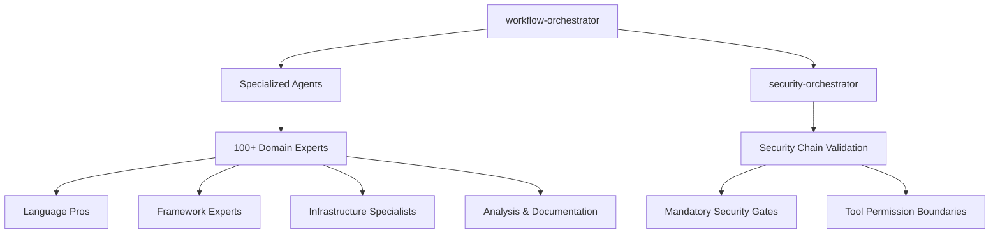
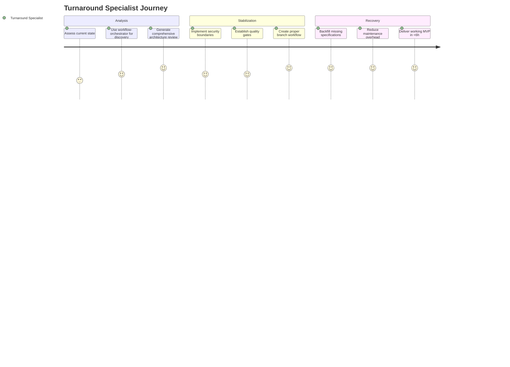
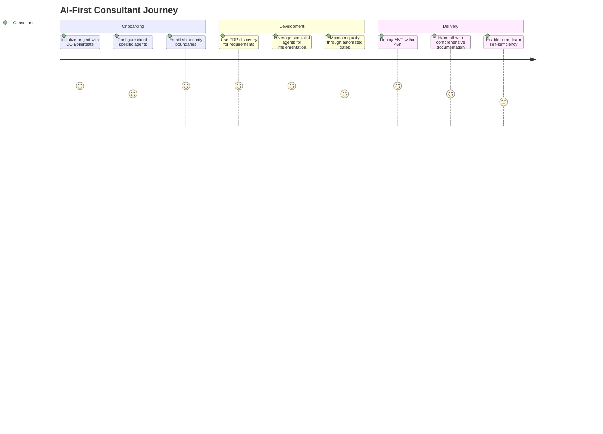
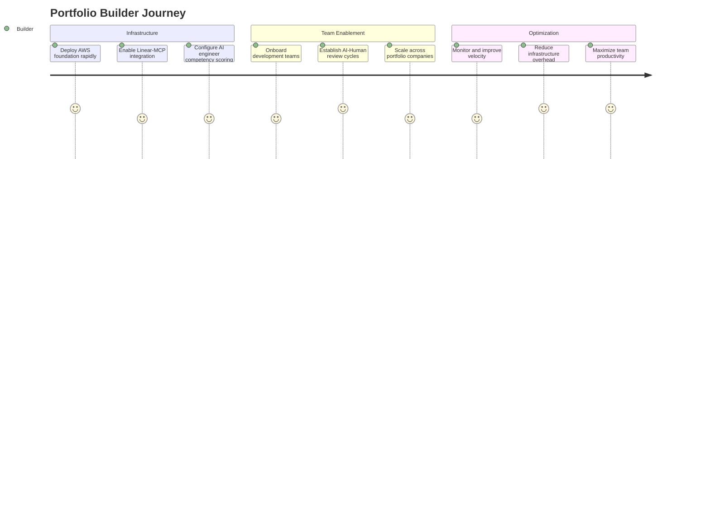
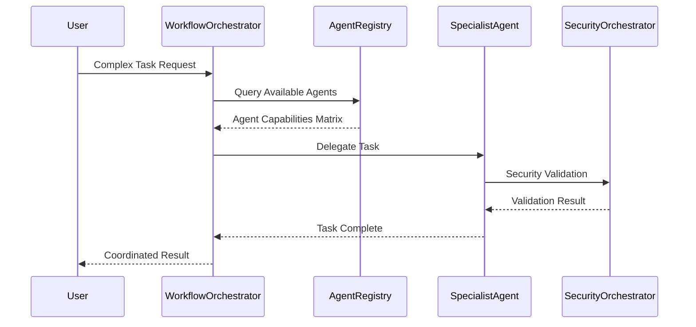
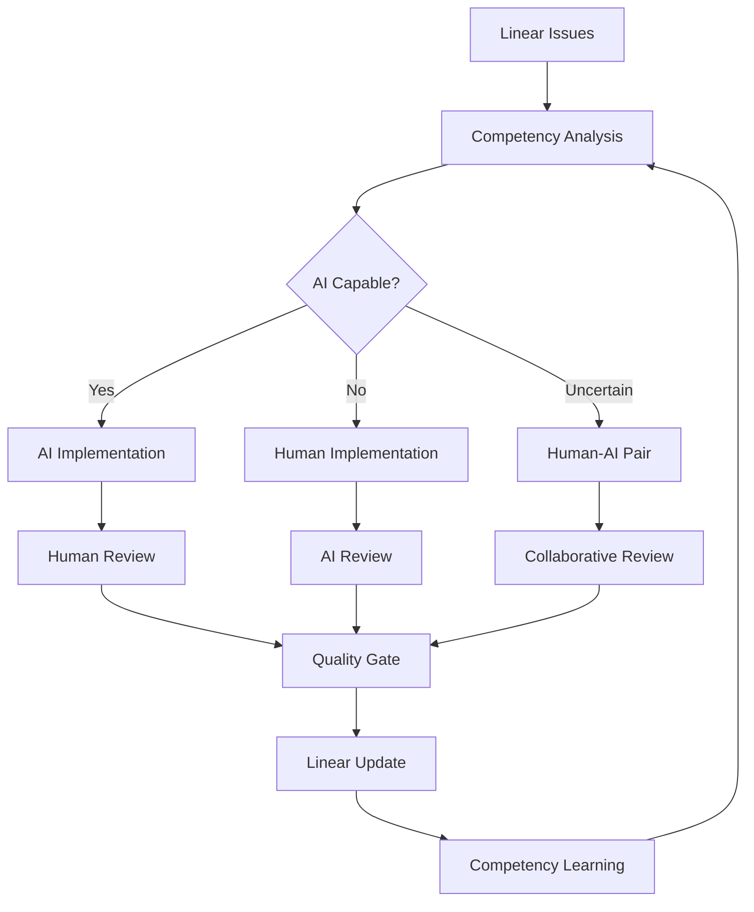
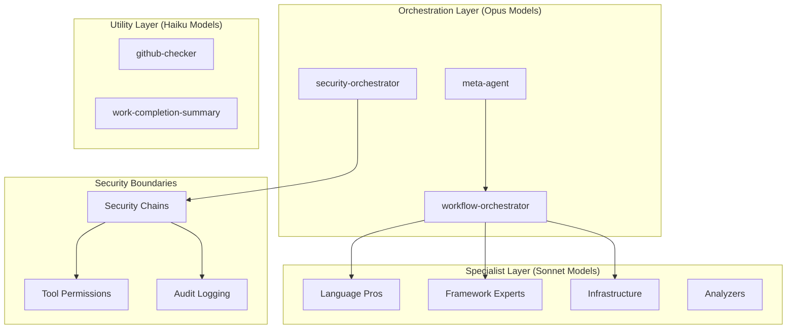
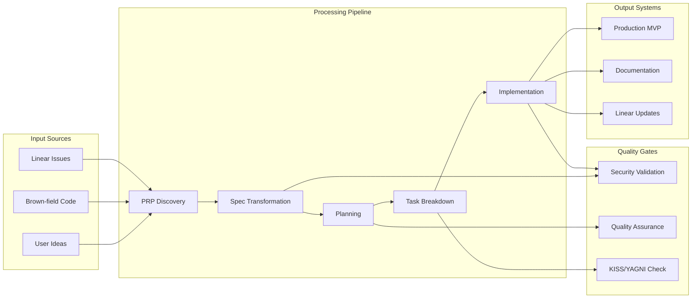
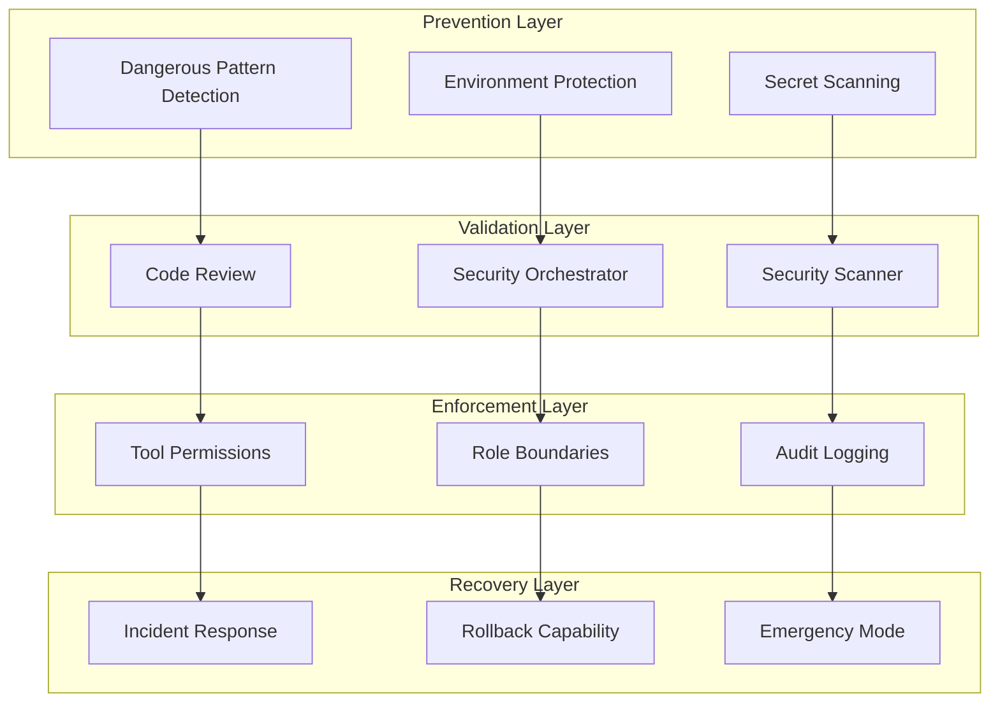

# CC-Boilerplate Strategic Accelerator Framework
## Product Requirements Document (PRD)

---

## 1. Executive Summary

### **Product Vision**
"Get in and out of any messy situation" - CC-Boilerplate is the ultimate Swiss Army knife for AI-first turnaround management, enabling rapid recovery from chaos and systematic acceleration of any development initiative.

### **Mission Statement**
Transform brown-field disasters and greenfield opportunities into production-ready systems within hours, not weeks, while maintaining enterprise-grade quality and security standards.

### **Strategic Positioning**
CC-Boilerplate positions as the **strategic accelerator framework** for:
- **Turnaround Management**: Rescuing complex projects that have lost focus
- **Consulting Acceleration**: Rapid prototyping and delivery for client engagements
- **Portfolio Development**: Internal tool creation for portfolio companies
- **Venture Founding**: Greenfield AI-first company creation

---

## 2. Problem Statement

### **Primary Problem: Brown-Field Turnaround Chaos**
Complex projects like TIIEE develop massive complexity, lose focus, require extensive maintenance, and suffer from:
- **Scope Bleed**: "Hey Joe, I have an idea" syndrome
- **Separation of Concerns Mess**: Implementation mixed with requirements
- **Intent-to-Implementation Drift**: What was planned ≠ what was built
- **Last 20% Burden**: Maintenance consumes 80% of effort

### **Secondary Problem: Consulting Velocity Constraints**
Client engagements require immediate productive deployment:
- **Onboarding Friction**: Getting productive takes days/weeks
- **Quality vs Speed**: High standards slow movement
- **Standard Divergence**: Each project reinvents the wheel
- **Trust vs Verify**: Need to start immediately while ensuring compliance

### **Tertiary Problem: Human Messiness**
"Humans are messy" - developers and teams inevitably create situations requiring rescue:
- **Mid-Journey Mistakes**: Wrong branch, mixed implementations, broken workflows
- **Context Loss**: Losing track of why decisions were made
- **Quality Drift**: Standards erosion under pressure
- **Recovery Difficulty**: Hard to get back on track

---

## 3. Solution Architecture

### **Core Philosophy: "Do One Thing Well"**
100+ battle-tested specialist agents, each mastering a specific domain, orchestrated through intelligent workflow management.

### **Four Pillars of Excellence**

#### **Pillar 1: Hierarchical Agent Orchestration**


#### **Pillar 2: Security-First Development**
- **30+ Dangerous Pattern Prevention**: Never `rm -rf /` disasters
- **Role-Based Tool Permissions**: Read-only agents cannot modify files
- **Mandatory Security Chains**: code-reviewer → security-orchestrator → security-scanner
- **Environment Protection**: Zero tolerance for secret exposure

#### **Pillar 3: Non-Blocking Quality Gates**
- **Trust But Verify**: Start immediately, course-correct continuously
- **Progressive Validation**: Quality gates that don't stop movement
- **Backfill Capability**: Fix architectural decisions mid-journey
- **KISS/YAGNI Enforcement**: Prevent over-engineering automatically

#### **Pillar 4: Mid-Journey Course Correction**
- **Smart Commit Recovery**: Split mixed implementations logically
- **Branch Workflow Repair**: Fix feature/release/main flow at any point
- **Context Reconstruction**: Regenerate specs/plans from existing code
- **Graceful Recovery**: Always a path back to clean state

---

## 4. User Personas & Journeys

### **Persona 1: The Turnaround Specialist**
**Background**: Technical leader called in to rescue failing projects
**Pain Points**:
- Projects with accumulated complexity (TIIEE scenario)
- Lost focus and unclear requirements
- High maintenance burden consuming resources
- Team demoralization from constant firefighting

**Journey with CC-Boilerplate**:


### **Persona 2: The AI-First Consultant**
**Background**: Accelerating client engagements with immediate productivity
**Pain Points**:
- Need to be productive on Day 1
- Client expects rapid prototyping and delivery
- Quality standards cannot be compromised
- Every project has unique constraints

**Journey with CC-Boilerplate**:


### **Persona 3: The Portfolio Company Builder**
**Background**: Creating internal tools for portfolio companies (XpertPulse scenario)
**Pain Points**:
- Need rapid AWS infrastructure deployment
- Enable development teams with minimal lead time
- Linear workflow integration for AI-Human teams
- Scale across multiple portfolio companies

**Journey with CC-Boilerplate**:


---

## 5. Core Features & Capabilities

### **Feature 1: Intelligent Agent Orchestration**

**Description**: Dynamic selection and coordination of 100+ specialist agents based on task complexity and domain requirements.

**User Stories**:
```yaml
Epic: Intelligent Agent Selection
Story 1: "As a developer, I want the system to automatically select the best agent for my task so that I get expert-level assistance without manual selection"
  Acceptance Criteria:
    - [ ] workflow-orchestrator analyzes task complexity automatically
    - [ ] Dynamic agent discovery scans available specialists
    - [ ] Cognitive load model allocates appropriate models (Haiku/Sonnet/Opus)
    - [ ] Agent selection completes in <2 seconds

Story 2: "As a turnaround specialist, I want agents to coordinate complex workflows so that I can focus on business logic rather than tool management"
  Acceptance Criteria:
    - [ ] Multi-agent workflows coordinate automatically
    - [ ] Security chains execute without manual intervention
    - [ ] Handoffs preserve context between agents
    - [ ] Parallel execution when possible for speed
```

**Technical Implementation**:


### **Feature 2: PRP Discovery Workflow**

**Description**: Automated context engineering that transforms rough ideas into comprehensive requirements through intelligent research and user interaction.

**User Stories**:
```yaml
Epic: Automated Requirements Discovery
Story 1: "As a consultant, I want to transform client ideas into comprehensive PRDs automatically so that I can start implementation immediately"
  Acceptance Criteria:
    - [ ] Rough idea input generates structured PRP
    - [ ] Automatic market and technical research
    - [ ] User interview automation with targeted questions
    - [ ] Visual documentation generation (Mermaid diagrams)
    - [ ] Context preservation for spec-kit integration

Story 2: "As a turnaround specialist, I want to reverse engineer PRDs from existing code so that I can understand and improve legacy systems"
  Acceptance Criteria:
    - [ ] Code analysis extracts intended functionality
    - [ ] Architecture discovery maps system components
    - [ ] Gap analysis identifies missing requirements
    - [ ] Backfill capability creates missing specifications
```

**PRP to Spec-Kit Integration Flow**:
```mermaid
graph LR
    A[Rough Idea] --> B[PRP Discovery]
    B --> C[Comprehensive PRP]
    C --> D[Transform to Spec]
    D --> E[/plan Command]
    E --> F[/tasks Command]
    F --> G[/implement Command]
    G --> H[Production MVP]

    B --> B1[Market Research]
    B --> B2[Technical Analysis]
    B --> B3[User Interview]

    C --> C1[Success Criteria]
    C --> C2[User Stories]
    C --> C3[Architecture Context]
```

### **Feature 3: Linear-MCP AI-Human Symbiosis**

**Description**: Bidirectional integration between Linear task management and AI development teams, enabling competency-based task allocation and automated quality reporting.

**User Stories**:
```yaml
Epic: AI-Human Team Integration
Story 1: "As a product manager, I want AI engineers to build competency scores on tasks so that I can optimize human-AI collaboration"
  Acceptance Criteria:
    - [ ] AI analyzes task complexity and builds confidence score
    - [ ] Tasks labeled as 'AI-doable' with certainty percentage
    - [ ] Human approval required for task assignment
    - [ ] Automatic progress reporting to Linear

Story 2: "As a developer, I want AI and human reviews to be equivalent so that quality is maintained regardless of implementation source"
  Acceptance Criteria:
    - [ ] AI implementations reviewed by humans
    - [ ] Human implementations reviewed by AI
    - [ ] Consistent quality gates for both paths
    - [ ] Learning feedback loop improves AI competency scoring
```

**Linear Integration Architecture**:


### **Feature 4: Mid-Journey Course Correction**

**Description**: Backfill capability that enables fixing architectural decisions, workflows, and implementations without starting over.

**User Stories**:
```yaml
Epic: Graceful Recovery System
Story 1: "As a developer, I want to fix my messy git workflow without losing work so that I can get back on track quickly"
  Acceptance Criteria:
    - [ ] /git-ops:smart-commit splits mixed implementations
    - [ ] /git-ops:start-release-journey fixes workflow at any point
    - [ ] Branch cleanup preserves all valuable work
    - [ ] Clear path back to proper workflow

Story 2: "As a project manager, I want to backfill missing specifications for existing code so that we can improve architecture without rewriting"
  Acceptance Criteria:
    - [ ] Code analysis generates missing PRPs
    - [ ] Architecture extraction creates proper documentation
    - [ ] Gap analysis identifies improvement opportunities
    - [ ] Implementation continues with proper foundation
```

---

## 6. Technical Architecture

### **Architecture Philosophy: Local CLI-First**

CC-Boilerplate is a CLI-based development assistant that drops directly into your local codebase. It operates entirely from the command line within your project directory, using Claude commands, local agents, and MCP servers for external integrations. There are no REST APIs or web services - everything runs locally as CLI tools and scripts.

**Key Principles:**
- **Local-First**: Runs entirely on developer machines, no cloud infrastructure required
- **CLI-Driven**: Uses Claude commands (/commands) for workflow orchestration
- **MCP Integration**: External services accessed via MCP servers, not REST APIs
- **Hook-Based Security**: Security implemented through local hooks and validation scripts
- **Drop-In Tool**: Integrates into any existing codebase without architectural changes

### **System Components**

#### **Agent System Architecture** (ADR-007)


#### **Data Flow Architecture**


### **Security Architecture**

#### **Multi-Layer Security Model**


### **Integration Ecosystem**

#### **External Service Integration**
```yaml
GitHub:
  purpose: "Repository management, PR workflows, issue tracking"
  integration: "gh CLI commands, local git hooks, GitHub Actions"
  implementation: "Pure CLI - no APIs, all via gh command"
  security: "Token-based authentication, scope limitations"

Linear:
  purpose: "Task management, AI-Human workflow coordination"
  integration: "Linear-MCP server for local data access"
  implementation: "MCP server pattern - no REST APIs"
  features: "Competency scoring, automated reporting via MCP protocol"

MCP Servers (Local Process Integration):
  serena: "Semantic code navigation, project memory"
  elevenlabs: "TTS for work completion summaries"
  ref: "Documentation context for unfamiliar APIs"
  firecrawl: "Web research and competitive analysis"
  linear: "Task management and AI-human workflow coordination"

Spec-Kit:
  purpose: "Structured development phases"
  integration: "uvx installation, CLI transformation commands"
  implementation: "Local CLI tools - no web services"
  workflow: "PRP → /plan → /tasks → /implement"

Claude Commands (Local Workflow):
  purpose: "Orchestration and automation via Claude IDE"
  implementation: "/commands directory with .md definitions"
  examples: "/smart-commit, /create-pull-request, /prp-execute"
  architecture: "Local hooks and scripts, no external APIs"
```

---

## 7. Success Metrics & KPIs

### **Primary Success Metrics**

#### **Speed Metrics**
- **Idea to MVP**: <6 hours (target), current baseline varies by complexity
- **Onboarding Time**: <30 minutes to productive development
- **Context Switch Time**: <5 minutes to understand any project state
- **Recovery Time**: <1 hour from any "messy situation" to clean state

#### **Impact Metrics**
- **Personal Productivity Multiplier**: 10x compared to traditional development
- **Team Velocity Increase**: 5x faster iteration cycles
- **Client Engagement Success**: 95% of consulting engagements meet <6h MVP target
- **Portfolio Company Acceleration**: 3x faster internal tool deployment

#### **Quality Metrics**
- **Security Incidents**: Zero tolerance for preventable security issues
- **Maintenance Overhead**: 80% reduction in "last 20%" effort
- **Technical Debt**: <10% of sprint capacity allocated to debt reduction
- **Implementation Drift**: <5% variance between specified and delivered functionality

### **Secondary Success Metrics**

#### **Business Metrics**
- **Client Satisfaction**: >95% would recommend CC-Boilerplate for turnarounds
- **Revenue Per Engagement**: 40% higher margin than traditional consulting
- **Portfolio ROI**: 25% faster time-to-market for portfolio companies
- **Market Position**: Recognized as leading AI-first turnaround solution

#### **Technical Metrics**
- **Test Coverage**: 100% for security-critical components
- **Agent Response Time**: <2 seconds for agent selection and task delegation
- **System Reliability**: 99.9% uptime for core orchestration systems
- **Integration Health**: <1% failure rate for external service connections

### **Risk Metrics (Inverse KPIs)**

#### **Failure Mode Prevention**
- **Scope Bleed Incidents**: <1 per month across all projects
- **Onboarding Failures**: <5% of new users unable to be productive in 30 minutes
- **Quality Escapes**: <1% of deliverables require post-delivery rework
- **Security Violations**: Zero incidents of dangerous command execution

---

## 8. Competitive Analysis & Differentiation

### **Primary Competitors**

#### **vs. Cursor/GitHub Copilot/Continue**
| Aspect | CC-Boilerplate | Cursor/Copilot |
|--------|----------------|----------------|
| **Scope** | Complete project orchestration | Code completion |
| **Quality Gates** | Mandatory security chains | Suggestion-based |
| **Architecture** | 100+ specialist agents | Single model |
| **Recovery** | Mid-journey course correction | None |
| **Security** | Zero-tolerance prevention | Post-hoc scanning |

#### **vs. AutoGPT/AgentGPT**
| Aspect | CC-Boilerplate | AutoGPT |
|--------|----------------|---------|
| **Control** | Human-supervised orchestration | Autonomous execution |
| **Quality** | Non-blocking validation gates | No quality control |
| **Specialization** | Battle-tested domain experts | General-purpose agents |
| **Recovery** | Graceful error handling | Unpredictable failure modes |
| **Enterprise** | Production-ready security | Research project |

#### **vs. LangChain/CrewAI**
| Aspect | CC-Boilerplate | LangChain |
|--------|----------------|-----------|
| **Abstraction** | High-level business workflows | Low-level tool orchestration |
| **Setup** | Zero-config for common patterns | Extensive configuration required |
| **Patterns** | Pre-built turnaround workflows | Build-your-own everything |
| **Maintenance** | Self-maintaining system | Constant manual updates |

### **Unique Value Proposition**

#### **Core Differentiators**
1. **"Get In and Out of Any Situation"**: Only solution designed for mid-journey recovery
2. **Battle-Tested Agents**: 100+ specialists proven in production environments
3. **Non-Blocking Quality**: Trust but verify approach maintains velocity
4. **Human Messiness Assumption**: Built for real-world chaos, not perfect workflows

#### **Sustainable Competitive Advantages**
1. **Turnaround Expertise**: Deep understanding of brown-field challenges
2. **AI-Human Symbiosis**: Advanced competency scoring and task allocation
3. **Ecosystem Integration**: Deep Linear, GitHub, spec-kit integration
4. **Security-First Architecture**: Prevents disasters that competitors allow

---

## 9. Business Model & Monetization

### **Revenue Streams**

#### **Primary: Strategic Consulting Integration**
- **Model**: Free during strategic consulting mandates with proper volume
- **Rationale**: Tool becomes competitive advantage and client acquisition driver
- **Value**: Higher margin consulting with faster delivery times
- **Scale**: 10-50 engagements per year at $50K-$500K range

#### **Secondary: Per-Project Licensing**
- **Model**: Per-project fees after consulting engagement
- **Rationale**: Higher margin, easier ROI justification than per-developer pricing
- **Value**: Project success insurance rather than tool cost
- **Scale**: 50-200 projects per year at $5K-$50K range

#### **Tertiary: Enterprise Support Packages**
- **Model**: Custom support and customization for large implementations
- **Rationale**: White-glove service for mission-critical deployments
- **Value**: Risk mitigation for enterprise transformation projects
- **Scale**: 5-20 enterprise deals per year at $100K-$1M range

### **Cost Structure**

#### **Development Costs**
- **Core Team**: 2-5 engineers focused on orchestration and integration
- **Community**: Open-source contributions for agent development
- **Infrastructure**: Claude service costs, CI/CD pipeline, development tools
- **Research**: Continuous improvement through real-world feedback

#### **Go-to-Market Costs**
- **Consulting Sales**: Relationship-based, minimal direct sales cost
- **Content Marketing**: Technical content, case studies, conference presence
- **Partnership Development**: GitHub, Linear, Claude integrations
- **Support Operations**: Documentation, training, incident response

### **Market Sizing**

#### **Serviceable Addressable Market (SAM)**
- **AI-First Consulting**: $2B market growing 40% annually
- **Technical Turnaround Services**: $5B market with 15% growth
- **Enterprise Development Tools**: $10B market with 25% growth

#### **Target Market Segments**
- **Primary**: Technical consulting firms adopting AI-first approaches
- **Secondary**: Enterprise development teams with rapid iteration needs
- **Tertiary**: Venture capital firms supporting portfolio company development

---

## 10. Implementation Roadmap

### **Phase 1: Foundation Stabilization (Months 1-3)**

#### **Core Platform**
- [ ] Complete agent system architecture compliance (100% test coverage)
- [ ] Finalize security boundary enforcement and validation
- [ ] Implement stable upgrade path for boilerplate synchronization
- [ ] Establish CI/CD pipeline with comprehensive validation gates

#### **Documentation & Training**
- [ ] Create comprehensive user onboarding documentation
- [ ] Develop video training series for core workflows
- [ ] Build interactive tutorials for common scenarios
- [ ] Establish support knowledge base and troubleshooting guides

#### **Validation**
- [ ] Complete 3 turnaround projects with <6h MVP delivery
- [ ] Achieve 100% security incident prevention rate
- [ ] Demonstrate 10x personal impact multiplier in controlled tests
- [ ] Validate onboarding time <30 minutes for new users

### **Phase 2: Linear Integration & AI-Human Symbiosis (Months 4-6)**

#### **Linear-MCP Development**
- [ ] Implement bidirectional Linear task synchronization
- [ ] Develop AI competency scoring system
- [ ] Create human-AI review cycle automation
- [ ] Build automated quality gate reporting for project managers

#### **Advanced Orchestration**
- [ ] Enhance workflow-orchestrator with Linear integration
- [ ] Implement task allocation optimization based on competency scores
- [ ] Develop learning feedback loops for AI improvement
- [ ] Create portfolio-wide analytics and reporting

#### **Validation**
- [ ] Deploy in XpertPulse with full Linear integration
- [ ] Achieve 95% accurate AI competency scoring
- [ ] Demonstrate seamless AI-human task handoffs
- [ ] Validate automated quality reporting accuracy

### **Phase 3: Multi-IDE Expansion (Months 7-9)**

#### **IDE Integration**
- [ ] Research VSCode extension architecture and requirements
- [ ] Develop Cursor integration layer and testing framework
- [ ] Create IDE-agnostic agent communication protocol
- [ ] Build configuration management for multi-IDE environments

#### **Agent Ecosystem**
- [ ] Expand agent library to 150+ specialists
- [ ] Implement agent marketplace for community contributions
- [ ] Create agent quality certification process
- [ ] Develop agent versioning and update management

#### **Validation**
- [ ] Successful deployment in 2+ IDEs beyond Claude Code
- [ ] Agent ecosystem growing at 10+ new agents per month
- [ ] Community contributions exceeding 30% of new agents
- [ ] Cross-IDE workflow compatibility validated

### **Phase 4: Enterprise Features (Months 10-12)**

#### **Enterprise Platform**
- [ ] Implement multi-tenant architecture with isolation
- [ ] Develop enterprise authentication and authorization
- [ ] Create audit logging and compliance reporting
- [ ] Build custom agent development and deployment tools

#### **Advanced Features**
- [ ] Implement advanced analytics and usage insights
- [ ] Develop predictive project health monitoring
- [ ] Create automated technical debt detection and remediation
- [ ] Build integration marketplace for enterprise tools

#### **Market Readiness**
- [ ] Complete regulatory compliance (SOC2, GDPR)
- [ ] Establish enterprise support processes and SLAs
- [ ] Develop partner channel program
- [ ] Create enterprise pricing and packaging strategy

---

## 11. Risk Assessment & Mitigation

### **High-Risk Scenarios**

#### **Risk 1: Agent Complexity Overwhelms Users**
- **Probability**: Medium
- **Impact**: High (defeats "immediate productivity" value proposition)
- **Mitigation**:
  - Progressive disclosure of agent capabilities
  - Intelligent defaults with workflow-orchestrator
  - Comprehensive onboarding with guided tutorials
  - User experience research and continuous improvement

#### **Risk 2: Security Incident Destroys Trust**
- **Probability**: Low
- **Impact**: Critical (zero-tolerance security requirement)
- **Mitigation**:
  - Multiple validation layers with redundancy
  - Comprehensive testing of dangerous pattern detection
  - Regular security audits and penetration testing
  - Incident response plan with immediate containment

#### **Risk 3: Linear Integration Complexity**
- **Probability**: Medium
- **Impact**: Medium (delays Phase 2 differentiation)
- **Mitigation**:
  - Prototype integration early with minimal viable features
  - Maintain fallback to manual Linear synchronization
  - Partner closely with Linear team for MCP server stability
  - Implement gradual rollout with feature flags

### **Medium-Risk Scenarios**

#### **Risk 4: Competitor Copies Core Features**
- **Probability**: High
- **Impact**: Medium (first-mover advantage vulnerable)
- **Mitigation**:
  - Focus on execution quality and user experience
  - Build defensible network effects through community
  - Continuously innovate with advanced features
  - Establish strong brand in turnaround specialist niche

#### **Risk 5: Claude Service Changes Break System**
- **Probability**: Medium
- **Impact**: Medium (platform dependency risk)
- **Mitigation**:
  - Abstract agent communication through standardized interface
  - Develop multi-model support (OpenAI, Anthropic, local models)
  - Maintain close relationship with Anthropic team
  - Implement graceful degradation for service issues

### **Low-Risk Scenarios**

#### **Risk 6: Market Adoption Slower Than Expected**
- **Probability**: Medium
- **Impact**: Low (consulting model provides revenue bridge)
- **Mitigation**:
  - Focus on demonstrable ROI in consulting engagements
  - Build case studies and reference customers
  - Adjust pricing model based on market feedback
  - Expand into adjacent markets if needed

---

## 12. Success Validation Framework

### **v1.0 Release Criteria**

#### **Technical Readiness**
- [ ] **100% Test Coverage**: All security-critical components fully tested
- [ ] **Stable Upgrade Path**: Boilerplate updates without breaking changes
- [ ] **Performance Benchmarks**: All response time SLAs consistently met
- [ ] **Security Validation**: Comprehensive penetration testing completed

#### **Market Validation**
- [ ] **Proof of Value**: 3+ turnaround projects with documented <6h MVP delivery
- [ ] **Client Success**: 95% client satisfaction in pilot deployments
- [ ] **ROI Demonstration**: Quantified 10x personal impact multiplier
- [ ] **Competitive Positioning**: Clear differentiation from alternatives validated

#### **Business Readiness**
- [ ] **Revenue Model**: Proven per-project pricing and customer acceptance
- [ ] **Support Operations**: Scalable support processes and documentation
- [ ] **Partnership Integration**: GitHub, Linear, Claude partnerships established
- [ ] **Growth Strategy**: Clear path to market expansion identified

### **Long-term Success Indicators (3-Year)**

#### **Market Leadership**
- [ ] **USP Defense**: 3-year defensible competitive advantage identified
- [ ] **Market Recognition**: Acknowledged leader in AI-first turnaround solutions
- [ ] **Ecosystem Integration**: Standard tool in AI development workflows
- [ ] **Community Growth**: Active contributor community exceeding 1000 developers

#### **Business Sustainability**
- [ ] **Revenue Growth**: $10M+ annual recurring revenue
- [ ] **Profitability**: Positive unit economics and sustainable growth
- [ ] **Team Scale**: 10-20 person team with clear specialization
- [ ] **Product-Market Fit**: Organic growth exceeding 50% annually

---

## 13. Next Steps & Call to Action

### **Immediate Actions (Next 30 Days)**

1. **PRD Validation & Feedback**
   - Review this PRD with key stakeholders and technical advisors
   - Validate success metrics and business model assumptions
   - Refine Phase 1 implementation plan based on feedback

2. **Spec-Kit Integration Planning**
   - Transform this PRD through spec-kit workflow
   - Generate detailed technical specifications using `/plan`
   - Create implementation task breakdown using `/tasks`

3. **Foundation Stabilization**
   - Complete agent compliance validation (100% pass rate)
   - Implement missing security boundary enforcement
   - Establish CI/CD pipeline with comprehensive testing

### **Strategic Partnerships (Next 60 Days)**

1. **GitHub Integration Enhancement**
   - Deepen spec-kit integration beyond basic transformation
   - Establish formal partnership for co-marketing opportunities
   - Collaborate on future GitHub Copilot workspace integration

2. **Linear Partnership Development**
   - Validate Linear-MCP architecture with Linear team
   - Establish development partnership for AI-human workflow features
   - Plan joint go-to-market for AI-first development teams

3. **Claude Code Ecosystem**
   - Contribute to Claude Code community with CC-Boilerplate patterns
   - Establish thought leadership in AI-assisted turnaround management
   - Build case studies demonstrating consulting acceleration

### **Success Measurement (Next 90 Days)**

1. **Pilot Project Execution**
   - Execute 3 turnaround projects with full measurement
   - Document time savings, quality improvements, and client satisfaction
   - Refine pricing model based on delivered value

2. **Technical Validation**
   - Achieve 100% security incident prevention rate
   - Demonstrate <6h MVP delivery consistently
   - Validate 10x personal impact multiplier with objective metrics

3. **Market Feedback Integration**
   - Gather feedback from pilot customers and adjust roadmap
   - Validate competitive positioning through market research
   - Refine value proposition based on actual user experiences

---

## Appendices

### **Appendix A: Technical Specifications**
- Complete agent capability matrix
- Security boundary enforcement details
- MCP server integration specifications
- Performance benchmarking methodology

### **Appendix B: User Research Data**
- Interview transcripts and analysis
- User journey mapping details
- Pain point prioritization matrix
- Competitive analysis research

### **Appendix C: Business Model Analysis**
- Financial projections and scenarios
- Market sizing methodology
- Pricing strategy analysis
- Revenue model validation plan

### **Appendix D: Implementation Details**
- Phase-by-phase technical requirements
- Resource allocation and timeline
- Risk mitigation playbooks
- Success validation checklists

---

**Document Status**: PROPOSED - Ready for stakeholder review and spec-kit transformation
**Next Action**: Transform to technical specification using `/plan` command
**Owner**: Strategic Product Development Team
**Review Cycle**: 30 days with stakeholder feedback integration