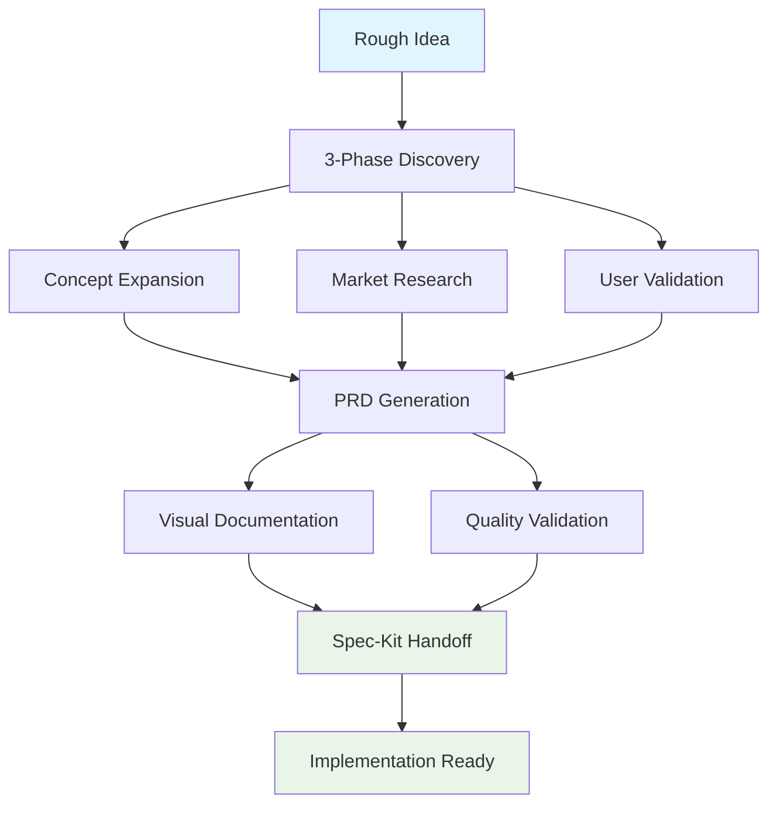
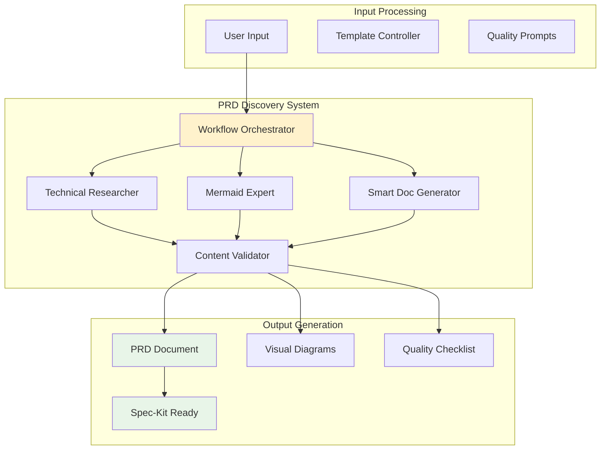
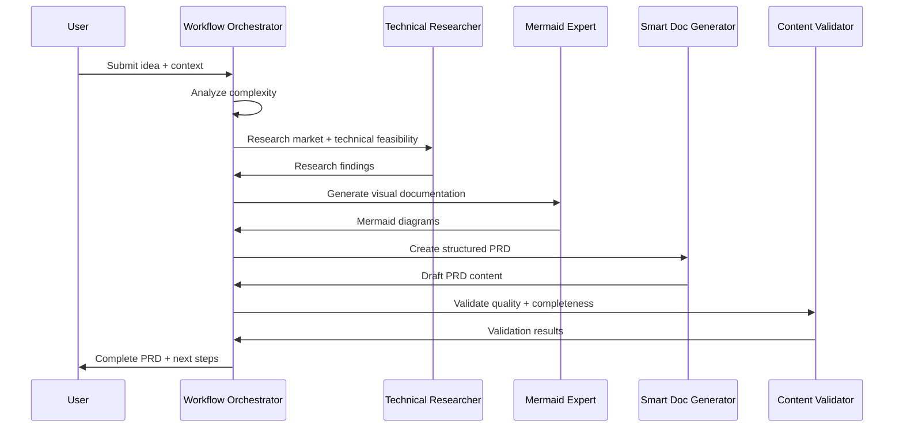
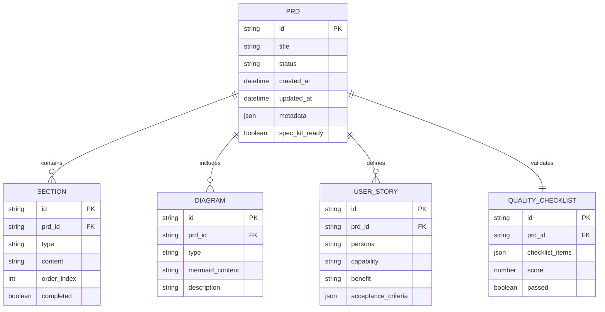
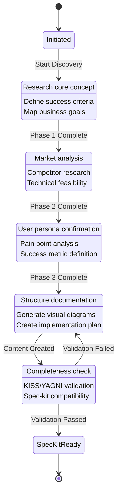
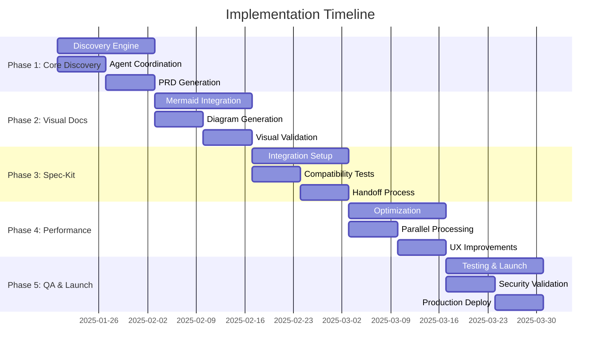

# PRD: PRP Discovery Workflow Automation System

## Executive Summary

**Product Name**: PRP Discovery Workflow Automation System
**Version**: 1.0
**Date**: 2025-01-20
**Status**: Ready for Implementation

### Problem Statement
Development teams spend 4-6 hours manually creating Product Requirements Documents (PRDs), often producing incomplete documentation that leads to implementation blockers, scope creep, and failed deliveries. Current manual processes lack structured discovery, visual documentation, and seamless handoff to implementation workflows.

### Solution Overview
An automated PRD discovery system that transforms rough ideas into comprehensive, implementation-ready documentation through a structured 3-phase discovery process, leveraging Claude Code's hierarchical agent architecture for intelligent research, analysis, and documentation generation.

### Success Metrics
- **Time Reduction**: 75% reduction in PRD creation time (from 4-6 hours to 1-1.5 hours)
- **Quality Improvement**: 90% reduction in implementation blockers due to incomplete requirements
- **Process Efficiency**: 100% of PRDs include visual documentation and spec-kit compatibility
- **Developer Satisfaction**: 85% improvement in developer confidence with requirement clarity

## Problem & Solution

### Current State Pain Points
1. **Manual Discovery**: Unstructured brainstorming leads to missed requirements and unclear scope
2. **Incomplete Documentation**: PRDs lack visual flows, technical specifications, and implementation guidance
3. **Poor Handoff**: No standardized transition from requirements to implementation planning
4. **Quality Inconsistency**: PRD quality varies significantly across teams and projects
5. **Time Inefficiency**: Repetitive research and documentation work across similar projects

### Proposed Solution
A structured, agent-orchestrated PRD discovery workflow that:
- **Automates Research**: Technical-researcher agent conducts market analysis and best practices research
- **Structures Discovery**: 3-phase process ensures comprehensive requirement gathering
- **Generates Visuals**: Automatic Mermaid diagram creation for user flows and system architecture
- **Validates Quality**: Built-in checklist ensures implementation readiness
- **Enables Handoff**: Direct integration with spec-kit workflow for seamless transition

## User Stories

### Epic: Automated PRD Discovery

#### Story 1: Rapid Idea Transformation
**As a** Product Manager
**I want** to transform rough feature ideas into comprehensive PRDs automatically
**So that** I can focus on strategy rather than documentation formatting

**Acceptance Criteria:**
- [ ] Input rough idea description and receive structured PRD within 90 minutes
- [ ] System prompts for missing critical information (user personas, success metrics)
- [ ] Generated PRD includes all required sections (problem, solution, architecture, implementation)
- [ ] Quality validation ensures PRD meets implementation readiness standards

**Technical Notes:**
- Workflow-orchestrator coordinates discovery process
- Technical-researcher handles market analysis
- Smart-doc-generator creates formatted documentation

#### Story 2: Visual Documentation Generation
**As a** Development Team Lead
**I want** automatic generation of user flow and architecture diagrams
**So that** my team has clear visual guidance for implementation

**Acceptance Criteria:**
- [ ] System generates Mermaid diagrams for user flows, system architecture, and data models
- [ ] Diagrams include error scenarios and edge cases
- [ ] Visual documentation integrates seamlessly with written requirements
- [ ] Diagrams are editable and version-controlled with the PRD

**Technical Notes:**
- Mermaid-expert agent generates standardized diagrams
- Integration with existing documentation workflow
- Support for complex system architectures

#### Story 3: Spec-Kit Integration
**As a** Technical Architect
**I want** PRDs to seamlessly transition to formal specifications
**So that** implementation planning begins immediately without documentation gaps

**Acceptance Criteria:**
- [ ] Generated PRDs are spec-kit compatible out of the box
- [ ] Clear handoff process from PRD to formal specification
- [ ] Technical specifications include API definitions and data models
- [ ] Implementation phases align with spec-kit workflow expectations

**Technical Notes:**
- PRD format matches spec-kit input requirements
- Technical specifications follow established patterns
- Clear dependency mapping for implementation planning



## Technical Architecture

### System Components



### Data Flow Architecture



### Agent Orchestration Strategy

**Primary Orchestrator**: Workflow-orchestrator (Opus model)
- Coordinates entire discovery process
- Manages agent handoffs and context flow
- Ensures quality and completeness

**Specialist Agents**:
- **Technical-researcher** (Opus): Market analysis, best practices research
- **Mermaid-expert** (Sonnet): Visual documentation generation
- **Smart-doc-generator** (Sonnet): Structured content creation
- **Content-validator** (Sonnet): Quality assurance and checklist validation

## API Specifications

### PRD Discovery Endpoint

```yaml
POST /api/prp/discover
Content-Type: application/json

Request:
{
  "idea": "string (required) - Rough feature description",
  "context": "string (optional) - Additional context or constraints",
  "user_personas": "array (optional) - Target user types",
  "business_goals": "array (optional) - Strategic objectives",
  "constraints": "object (optional) - Technical or business limitations"
}

Response:
{
  "prd_id": "string - Unique PRD identifier",
  "status": "string - Generation status",
  "estimated_completion": "number - Minutes until completion",
  "discovery_phases": {
    "concept_expansion": "object - Phase 1 results",
    "market_research": "object - Phase 2 results",
    "user_validation": "object - Phase 3 results"
  }
}
```

### PRD Status Endpoint

```yaml
GET /api/prp/{prd_id}/status

Response:
{
  "prd_id": "string",
  "status": "enum [in_progress, completed, failed]",
  "progress": "number - Percentage complete",
  "current_phase": "string - Active discovery phase",
  "generated_sections": "array - Completed PRD sections",
  "quality_score": "number - Completeness rating",
  "spec_kit_ready": "boolean - Ready for handoff"
}
```

### PRD Content Endpoint

```yaml
GET /api/prp/{prd_id}/content

Response:
{
  "prd_content": "string - Full PRD markdown",
  "visual_diagrams": "array - Mermaid diagram definitions",
  "quality_checklist": "object - Validation results",
  "spec_kit_metadata": "object - Handoff information",
  "implementation_phases": "array - Ordered task breakdown"
}
```

## Data Models

### PRD Document Model



### Discovery Process Model



## Implementation Phases

### Phase 1: Core Discovery Engine (Weeks 1-2)
**Objective**: Implement basic 3-phase discovery workflow with agent coordination

**Key Components**:
- Workflow-orchestrator integration for discovery coordination
- Technical-researcher agent configuration for market analysis
- Basic PRD template generation with required sections
- Quality validation framework with pass/fail criteria

**Success Criteria**:
- [ ] 3-phase discovery process executes end-to-end
- [ ] Technical-researcher completes market analysis within 30 minutes
- [ ] Generated PRDs include all required sections
- [ ] Quality validation identifies missing components

**Dependencies**:
- Existing agent system (workflow-orchestrator, technical-researcher)
- PRD template structure
- Quality checklist definition

### Phase 2: Visual Documentation System (Weeks 3-4)
**Objective**: Add automatic visual documentation generation with Mermaid diagrams

**Key Components**:
- Mermaid-expert agent integration for diagram generation
- User flow visualization for happy path and error scenarios
- System architecture diagrams with component relationships
- Data model visualization with entity relationships

**Success Criteria**:
- [ ] User flow diagrams generated automatically from user stories
- [ ] System architecture reflects technical requirements accurately
- [ ] Data model diagrams align with API specifications
- [ ] All diagrams are editable and version-controlled

**Dependencies**:
- Phase 1 completion
- Mermaid-expert agent availability
- Diagram template standards

### Phase 3: Spec-Kit Integration (Weeks 5-6)
**Objective**: Enable seamless handoff from PRD to formal specification workflow

**Key Components**:
- Spec-kit compatibility validation for generated PRDs
- Metadata generation for smooth handoff process
- Implementation phase breakdown with clear dependencies
- API specification integration with spec-kit requirements

**Success Criteria**:
- [ ] Generated PRDs pass spec-kit compatibility validation
- [ ] Handoff process requires no manual reformatting
- [ ] Implementation phases align with spec-kit workflow expectations
- [ ] API specifications meet formal documentation standards

**Dependencies**:
- Phase 2 completion
- Spec-kit workflow integration points
- API specification standards

### Phase 4: Performance Optimization (Weeks 7-8)
**Objective**: Optimize discovery process for speed and quality improvements

**Key Components**:
- Agent coordination optimization for parallel processing
- Template caching for faster PRD generation
- Quality validation performance improvements
- User experience enhancements for faster input processing

**Success Criteria**:
- [ ] PRD generation completes within 90 minutes for complex features
- [ ] Agent coordination reduces waiting time by 50%
- [ ] Quality validation provides real-time feedback
- [ ] User input process guides discovery efficiently

**Dependencies**:
- Phase 3 completion
- Performance monitoring implementation
- User feedback collection

### Phase 5: Quality Assurance & Launch (Weeks 9-10)
**Objective**: Comprehensive testing and production readiness

**Key Components**:
- End-to-end testing with real project scenarios
- Security validation for agent tool permissions
- Documentation completion for user onboarding
- Monitoring and analytics implementation

**Success Criteria**:
- [ ] All validation levels pass consistently
- [ ] Security boundaries enforced throughout workflow
- [ ] User documentation enables self-service adoption
- [ ] Monitoring provides visibility into system performance

**Dependencies**:
- Phase 4 completion
- Testing environment setup
- Production deployment readiness



## Risks & Mitigations

### Technical Risks

**Risk**: Agent coordination complexity may cause timeouts or failures
- **Probability**: Medium
- **Impact**: High
- **Mitigation**: Implement fallback mechanisms, timeout handling, and manual override options
- **Monitoring**: Track agent response times and failure rates

**Risk**: Quality validation may be inconsistent across different project types
- **Probability**: Medium
- **Impact**: Medium
- **Mitigation**: Develop domain-specific quality checklists and validation rules
- **Monitoring**: Track quality scores and implementation success rates

**Risk**: Spec-kit integration may break with workflow updates
- **Probability**: Low
- **Impact**: High
- **Mitigation**: Version-controlled integration points and backward compatibility testing
- **Monitoring**: Automated integration tests with spec-kit workflow

### Process Risks

**Risk**: Users may provide insufficient context for quality discovery
- **Probability**: High
- **Impact**: Medium
- **Mitigation**: Implement guided prompts and context validation requirements
- **Monitoring**: Track PRD quality scores by initial context completeness

**Risk**: Generated PRDs may require significant manual editing
- **Probability**: Medium
- **Impact**: Medium
- **Mitigation**: Iterative improvement based on user feedback and editing patterns
- **Monitoring**: Track manual editing frequency and types of changes

### Business Risks

**Risk**: Adoption may be slow due to process change resistance
- **Probability**: Medium
- **Impact**: Medium
- **Mitigation**: Phased rollout with champions, training, and success showcases
- **Monitoring**: Track adoption rates and user satisfaction scores

**Risk**: Quality improvement claims may not materialize in practice
- **Probability**: Low
- **Impact**: High
- **Mitigation**: Rigorous measurement of before/after metrics with control groups
- **Monitoring**: Implementation blocker rates and development velocity metrics

## Success Metrics

### Primary Metrics

**Time Efficiency**
- **Target**: 75% reduction in PRD creation time
- **Measurement**: Average time from idea submission to spec-kit ready PRD
- **Current Baseline**: 4-6 hours manual process
- **Target Achievement**: 1-1.5 hours automated process

**Quality Improvement**
- **Target**: 90% reduction in implementation blockers
- **Measurement**: Number of clarification requests during implementation
- **Current Baseline**: 3-5 blockers per PRD on average
- **Target Achievement**: <0.5 blockers per PRD

**Process Adoption**
- **Target**: 85% of new projects use automated PRD discovery
- **Measurement**: Percentage of PRDs generated through automation vs manual
- **Current Baseline**: 0% automated
- **Target Achievement**: 85% automated within 6 months

### Secondary Metrics

**Documentation Completeness**
- **Target**: 100% of PRDs include visual documentation
- **Measurement**: Presence of user flows, architecture diagrams, and data models
- **Current Baseline**: ~30% include any visual documentation
- **Target Achievement**: 100% automated inclusion

**Developer Satisfaction**
- **Target**: 85% improvement in requirement clarity confidence
- **Measurement**: Survey responses on requirement comprehension
- **Current Baseline**: 60% satisfaction with requirement clarity
- **Target Achievement**: 90%+ satisfaction rating

**Spec-Kit Integration**
- **Target**: 100% successful handoff to spec-kit workflow
- **Measurement**: Percentage of PRDs that transition without manual intervention
- **Current Baseline**: ~40% successful direct handoff
- **Target Achievement**: 100% automated handoff

### Monitoring & Analytics

**Real-Time Dashboards**
- Discovery process completion rates by phase
- Average generation time by complexity level
- Quality validation scores and failure reasons
- Agent coordination success rates

**Weekly Reports**
- PRD generation volume and trends
- User satisfaction and feedback summary
- Implementation blocker analysis
- Spec-kit integration success rates

**Monthly Reviews**
- ROI analysis on time savings achieved
- Quality improvement trend analysis
- Process optimization opportunities
- User adoption and training needs

## Appendices

### Appendix A: Agent Tool Permissions

```yaml
workflow-orchestrator:
  model: opus
  tools: ["*"]  # Full coordination capabilities
  permissions: confirmation_required

technical-researcher:
  model: opus
  tools: [Read, WebSearch, WebFetch, mcp__Ref]
  permissions: research_only

mermaid-expert:
  model: sonnet
  tools: [Read, Write, Edit]
  permissions: diagram_generation

smart-doc-generator:
  model: sonnet
  tools: [Read, Write, Edit, Grep, Glob]
  permissions: documentation_creation
```

### Appendix B: Quality Validation Checklist

- [ ] **Problem clearly articulated** with quantified pain points
- [ ] **Solution addresses problem** with clear value proposition
- [ ] **All user flows diagrammed** including error scenarios
- [ ] **Architecture visualized** with component relationships
- [ ] **APIs fully specified** with request/response examples
- [ ] **Data models included** with entity relationships
- [ ] **Dependencies identified** with clear sequencing
- [ ] **Risks identified and mitigated** with monitoring plans
- [ ] **Success metrics measurable** with specific targets
- [ ] **Implementation phases logical** with realistic timelines
- [ ] **Spec-kit compatibility validated** for seamless handoff
- [ ] **KISS/YAGNI principles applied** throughout design

### Appendix C: PRD Template Structure

```markdown
1. Executive Summary
   - Problem Statement
   - Solution Overview
   - Success Metrics

2. Problem & Solution
   - Current State Pain Points
   - Proposed Solution

3. User Stories (with diagrams)
   - Epic Definition
   - Individual Stories with Acceptance Criteria
   - User Flow Diagrams

4. Technical Architecture (with diagrams)
   - System Components
   - Data Flow Architecture
   - Integration Points

5. API Specifications
   - Endpoint Definitions
   - Request/Response Examples
   - Error Handling

6. Data Models
   - Entity Relationship Diagrams
   - Schema Definitions
   - State Machine Models

7. Implementation Phases
   - Phase Breakdown with Dependencies
   - Success Criteria per Phase
   - Timeline Visualization

8. Risks & Mitigations
   - Technical, Process, and Business Risks
   - Mitigation Strategies
   - Monitoring Plans

9. Success Metrics
   - Primary and Secondary Metrics
   - Measurement Approaches
   - Analytics Framework

10. Appendices
    - Technical Details
    - Reference Materials
    - Validation Checklists
```

### Appendix D: Troubleshooting Guide

**Common Issues and Solutions**

*Issue*: Discovery process times out during market research phase
*Solution*: Reduce research scope, implement parallel processing, add timeout handling

*Issue*: Generated diagrams don't accurately reflect requirements
*Solution*: Improve context passing between agents, validate diagram accuracy

*Issue*: PRD quality validation fails consistently
*Solution*: Review validation criteria, adjust for project complexity, gather user feedback

*Issue*: Spec-kit handoff fails due to format incompatibility
*Solution*: Update PRD templates, validate integration points, test with spec-kit team

**Support Contacts**
- Technical Issues: Development team lead
- Process Questions: Product management
- Integration Support: Spec-kit workflow team
- Agent System: Claude Code architecture team