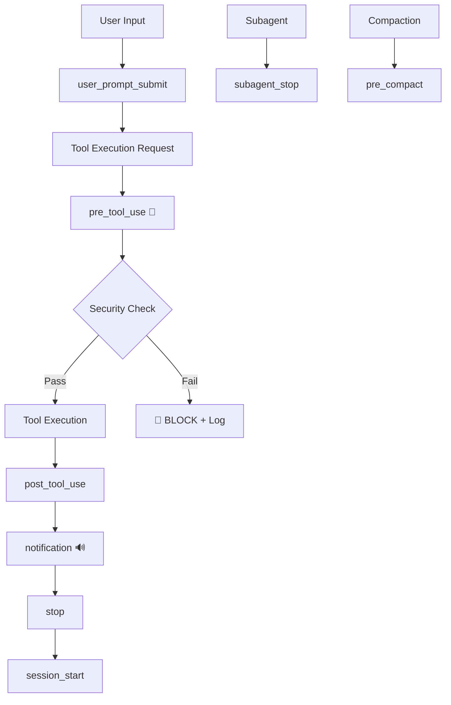
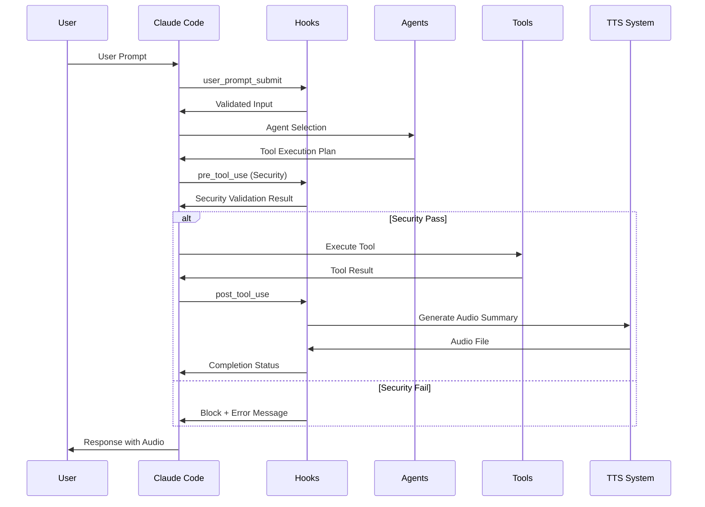

# Architecture Overview

## Table of Contents

- [System Overview](#system-overview)
- [Component Architecture](#component-architecture)
- [Data Flow and Interactions](#data-flow-and-interactions)
- [Security Architecture](#security-architecture)
- [Extension Points](#extension-points)
- [Design Patterns](#design-patterns)
- [Performance Characteristics](#performance-characteristics)

## System Overview

CC-Boilerplate is a **comprehensive Claude Code configuration** that extends the base functionality with security-focused hooks, intelligent agents, and multi-provider TTS capabilities.

### Core Principles

```
🏗️ **LAYERED ARCHITECTURE** - Clear separation of concerns
🔐 **SECURITY FIRST** - Built-in protection at every layer
🔌 **EXTENSIBLE DESIGN** - Easy to add new components
⚡ **PERFORMANCE FOCUSED** - Optimized execution paths
🎯 **SINGLE RESPONSIBILITY** - Each component has one clear purpose
```

### High-Level Architecture

```
┌─────────────────────────────────────────────────────┐
│                   Claude Code                       │
├─────────────────────────────────────────────────────┤
│  CC-Boilerplate Extension Layer                     │
│                                                     │
│  ┌─────────────┐ ┌─────────────┐ ┌─────────────┐    │
│  │    Hooks    │ │   Agents    │ │   Styles    │    │
│  │  (8 hooks)  │ │ (8 agents)  │ │ (8 styles)  │    │
│  └─────────────┘ └─────────────┘ └─────────────┘    │
│                                                     │
│  ┌─────────────────────────────────────────────────┐ │
│  │         Utility Layer                           │ │
│  │  TTS Providers │ LLM Utils │ Status Lines      │ │
│  └─────────────────────────────────────────────────┘ │
│                                                     │
│  ┌─────────────────────────────────────────────────┐ │
│  │         Foundation Layer                        │ │
│  │  UV Scripts │ JSON I/O │ Security Validation   │ │
│  └─────────────────────────────────────────────────┘ │
└─────────────────────────────────────────────────────┘
```

## Component Architecture

### Hook System Architecture

The hook system implements the **Chain of Responsibility** pattern with security-first design.



#### Hook Components

##### 1. Input Processing Layer

- **user_prompt_submit.py**: Input validation and preprocessing
- **session_start.py**: Context loading and environment setup

##### 2. Security Validation Layer

- **pre_tool_use.py**: **CRITICAL** - Security validation before execution
  For complete security patterns and protection details, see [Security Guide](../guides/security.md).

##### 3. Execution & Output Layer

- **post_tool_use.py**: Result processing and logging
- **notification.py**: Intelligent notifications with TTS
- **stop.py**: Task completion handling

##### 4. Lifecycle Management Layer

- **subagent_stop.py**: Subagent completion handling
- **pre_compact.py**: Transcript archival before compaction

### Agent System Architecture

Agents implement the **Strategy Pattern** with specialized tool access.

```
┌─────────────────┐    ┌─────────────────┐    ┌─────────────────┐
│  Meta-Agents    │    │ Code Agents     │    │ Content Agents  │
│                 │    │                 │    │                 │
│ • meta-agent    │    │ • code-reviewer │    │ • doc-generator │
│ • test-auto     │    │ • coverage-     │    │ • work-summary  │
│   mator         │    │   analyzer      │    │ • tts-summary   │
└─────────────────┘    └─────────────────┘    └─────────────────┘
        │                       │                       │
        ▼                       ▼                       ▼
┌─────────────────────────────────────────────────────────────────┐
│                    Agent Framework                              │
│                                                                 │
│  Tool Access Control │ Context Management │ Result Processing  │
└─────────────────────────────────────────────────────────────────┘
```

#### Agent Categories

##### Meta-Agents (System Enhancement)

- **meta-agent**: Generates new agents from descriptions
- **test-automator**: Creates comprehensive test suites
- **test-coverage-analyzer**: Analyzes and improves test coverage

##### Code Quality Agents

- **engineer-code-reviewer**: Automated code quality and security reviews
- **technical-researcher**: In-depth technical research and analysis

##### Content & Communication Agents

- **smart-doc-generator**: Comprehensive documentation generation
- **work-completion-summary**: Audio task summaries
- **llm-ai-agents-and-eng-research**: AI/ML research specialist

### TTS Provider Architecture

Multi-provider fallback system implementing **Chain of Responsibility** for audio output.

For detailed TTS architecture, provider comparison, and configuration details, see [TTS System Reference](../reference/tts-system.md).

For detailed TTS provider selection logic and fallback implementation, see [TTS System Reference](../reference/tts-system.md#fallback-logic).

### Output Style System

Template-based output formatting with **Template Method Pattern**.

```
┌─────────────────┐    ┌─────────────────┐    ┌─────────────────┐
│ Structured      │    │   Interactive   │    │   Specialized   │
│                 │    │                 │    │                 │
│ • yaml-struct   │    │ • genui         │    │ • tts-summary   │
│ • table-based   │    │ • html-struct   │    │ • ultra-concise │
│ • json-struct   │    │ • markdown-foc  │    │                 │
│ • bullet-points │    │                 │    │                 │
└─────────────────┘    └─────────────────┘    └─────────────────┘
```

## Data Flow and Interactions

### Primary Execution Flow



### Hook Execution Pipeline

```python
class HookPipeline:
    """
    Sequential execution of hooks with error handling.
    """
    def execute(self, context):
        stages = [
            ('user_prompt_submit', self.validate_input),
            ('pre_tool_use', self.security_check),      # CRITICAL
            ('post_tool_use', self.process_result),
            ('notification', self.send_notification),
            ('stop', self.handle_completion)
        ]

        for stage_name, handler in stages:
            try:
                result = handler(context)
                if result.should_block():
                    return BlockedResult(stage_name, result.reason)
            except Exception as e:
                return ErrorResult(stage_name, str(e))

        return SuccessResult()
```

### Security Validation Flow

```
┌─────────────────┐
│ Tool Execution  │
│    Request      │
└─────────────────┘
        │
        ▼
┌─────────────────┐
│ Input Parsing   │ ── Parse JSON input
│ & Validation    │ ── Validate structure
└─────────────────┘
        │
        ▼
┌─────────────────┐    ❌ Block
│ .env File       │ ──────────▶ Exit Code 2
│ Protection      │
└─────────────────┘
        │ ✅ Pass
        ▼
┌─────────────────┐    ❌ Block
│ Dangerous Cmd   │ ──────────▶ Exit Code 1
│ Detection       │
└─────────────────┘
        │ ✅ Pass
        ▼
┌─────────────────┐    ❌ Block
│ Path Traversal  │ ──────────▶ Exit Code 3
│ Check           │
└─────────────────┘
        │ ✅ Pass
        ▼
┌─────────────────┐
│ Allow Tool      │ ──────────▶ Exit Code 0
│ Execution       │
└─────────────────┘
```

### Agent Workflow Integration

```python
class AgentWorkflow:
    """
    Agent execution integrated with hook pipeline.
    """
    def execute_agent(self, agent_name, task):
        # 1. Load agent configuration
        config = self.load_agent_config(agent_name)

        # 2. Initialize agent with tool access
        agent = Agent(config, tool_access=config.tools)

        # 3. Execute with security validation
        for tool_call in agent.plan_execution(task):
            # Each tool call goes through security hooks
            if not self.security_validate(tool_call):
                raise SecurityBlockedError(tool_call)

            result = self.execute_tool(tool_call)
            agent.process_result(result)

        # 4. Generate completion summary
        return agent.finalize_result()
```

## Security Architecture

### Layered Security Model

```
┌─────────────────────────────────────────────────────┐
│ Layer 4: Audit & Monitoring                        │
│ • Security event logging                           │
│ • Performance monitoring                           │
│ • Threat detection                                 │
└─────────────────────────────────────────────────────┘
┌─────────────────────────────────────────────────────┐
│ Layer 3: Runtime Protection                        │
│ • Command execution validation                      │
│ • File access control                              │
│ • Network security                                 │
└─────────────────────────────────────────────────────┘
┌─────────────────────────────────────────────────────┐
│ Layer 2: Input Validation                          │
│ • JSON schema validation                           │
│ • Parameter sanitization                           │
│ • Path traversal prevention                        │
└─────────────────────────────────────────────────────┘
┌─────────────────────────────────────────────────────┐
│ Layer 1: Pre-execution Security                    │
│ • Dangerous command detection                       │
│ • Environment file protection                      │
│ • Security pattern matching                        │
└─────────────────────────────────────────────────────┘
```

### Security Component Integration

```python
class SecurityManager:
    """
    Centralized security management across all components.
    """
    def __init__(self):
        self.validators = [
            DangerousCommandValidator(),
            EnvFileProtectionValidator(),
            PathTraversalValidator(),
            InputSanitizationValidator()
        ]
        self.audit_logger = SecurityAuditLogger()

    def validate_execution(self, tool_name, parameters):
        """
        Multi-layer security validation.
        """
        context = ExecutionContext(tool_name, parameters)

        for validator in self.validators:
            result = validator.validate(context)
            self.audit_logger.log_validation(validator, result)

            if result.is_blocked():
                raise SecurityException(
                    validator=validator.__class__.__name__,
                    reason=result.reason,
                    details=result.details
                )

        return ValidationResult.success()
```

## Extension Points

### Adding New Hooks

```python
# Template for new hook
#!/usr/bin/env -S uv run --script
# /// script
# requires-python = ">=3.8"
# dependencies = ["python-dotenv"]
# ///

import json
import sys
from pathlib import Path

def main():
    try:
        # 1. Read JSON input
        input_data = json.load(sys.stdin)

        # 2. Process hook logic
        result = process_hook_logic(input_data)

        # 3. Output JSON result
        print(json.dumps(result))

        # 4. Exit with appropriate code
        sys.exit(0 if result.get('success') else 1)

    except Exception as e:
        print(json.dumps({"error": str(e)}), file=sys.stderr)
        sys.exit(2)

def process_hook_logic(input_data):
    """Implement your hook logic here."""
    return {"success": True, "data": "processed"}

if __name__ == "__main__":
    main()
```

### Adding New Agents

```markdown
# New Agent Template (agent-name.md)

**Agent Name**: Custom Agent
**Purpose**: Describe the agent's specific purpose
**Tools**: List of required tools
**Model**: Recommended model (default: latest Claude)

## Description
Detailed description of what the agent does and when to use it.

## Usage Examples
- Example use case 1
- Example use case 2

## Tool Requirements
- Tool 1: Why this tool is needed
- Tool 2: Purpose of this tool

## Behavioral Guidelines
- How the agent should behave
- What patterns to follow
- Error handling approach
```

### Adding New TTS Providers

```python
class CustomTTSProvider:
    """
    Template for new TTS provider integration.
    """
    def __init__(self, api_key=None):
        self.api_key = api_key
        self.is_available = self._check_availability()

    def _check_availability(self):
        """Check if provider is available and configured."""
        return bool(self.api_key) and self._test_connection()

    def synthesize_speech(self, text, voice=None, **kwargs):
        """
        Synthesize text to speech.

        Args:
            text: Text to convert to speech
            voice: Voice selection (provider-specific)
            **kwargs: Additional provider-specific options

        Returns:
            AudioFile: Generated audio file path
        """
        if not self.is_available:
            raise TTSProviderUnavailableError()

        # Implement provider-specific synthesis logic
        audio_file = self._call_provider_api(text, voice, **kwargs)
        return AudioFile(audio_file)

    def get_available_voices(self):
        """Return list of available voices."""
        pass

    def _call_provider_api(self, text, voice, **kwargs):
        """Provider-specific API call implementation."""
        pass
```

### Adding New Output Styles

```markdown
# Custom Output Style Template

## Style Configuration
- **Name**: custom-style
- **Purpose**: Brief description of output format
- **Use Cases**: When to use this style

## Template Structure
```

Custom formatted output with:

- Specific formatting rules
- Template variables
- Output structure

```

## Implementation
[Specific formatting logic and examples]
```

## Design Patterns

### 1. Chain of Responsibility (Hooks)

- Each hook processes request and passes to next
- Security hooks can break the chain by blocking
- Error handling and logging at each step

### 2. Strategy Pattern (Agents & TTS)

- Interchangeable implementations of same interface
- Runtime selection based on context/availability
- Easy extension with new providers/agents

### 3. Template Method (Output Styles)

- Common structure with customizable details
- Consistent output formatting framework
- Easy style addition and modification

### 4. Observer Pattern (Event Logging)

- Components emit events for monitoring
- Centralized logging and audit trail
- Performance monitoring and debugging

### 5. Factory Pattern (Component Creation)

- Centralized creation of hooks, agents, TTS providers
- Configuration-driven instantiation
- Easy testing and mocking

## Performance Characteristics

### Execution Times

| Component | Typical | Maximum | Critical Path |
|-----------|---------|---------|---------------|
| Hooks | <200ms | 5s | Yes |
| Security Validation | <50ms | 1s | **Critical** |
| TTS Synthesis | 1-3s | 30s | No |
| Agent Execution | 5-60s | 10min | No |

### Memory Usage

```
┌─────────────────────────────────────────────────────┐
│ Memory Usage by Component                           │
│                                                     │
│ Claude Code Base:     ~50-100MB                     │
│ CC-Boilerplate:       ~10-20MB                      │
│ Active Hooks:         ~5-10MB                       │
│ TTS Providers:        ~10-30MB                      │
│ Agent Execution:      ~20-100MB (temporary)         │
│                                                     │
│ Total Typical:        ~95-260MB                     │
└─────────────────────────────────────────────────────┘
```

### Scalability Considerations

#### Horizontal Scaling

- Hooks are stateless and parallelizable
- TTS providers support concurrent synthesis
- Agent execution can be distributed

#### Vertical Scaling

- Memory usage scales with active components
- CPU usage dominated by TTS and LLM operations
- I/O performance critical for file operations

#### Performance Optimization

- Lazy loading of non-critical components
- Caching of frequently used data
- Asynchronous TTS synthesis where possible
- Connection pooling for API providers

## Architecture Evolution

### Current Architecture (v1.0)

- Monolithic hooks with embedded utilities
- Single-file UV script approach
- Direct provider integration

### Future Architecture Considerations (v2.0+)

- **Microservice Hooks**: Separate processes for complex hooks
- **Plugin Architecture**: Dynamic loading of extensions
- **Distributed TTS**: Remote TTS service deployment
- **Advanced Security**: ML-based threat detection
- **Performance Optimization**: Compiled hooks for speed

### Migration Strategy

- Backward compatibility maintained
- Incremental component modernization
- Configuration-driven feature flags
- Staged rollout of architectural changes

This architecture provides a solid foundation for secure, extensible, and performant Claude Code enhancement while maintaining the KISS/YAGNI principles that guide the project.
