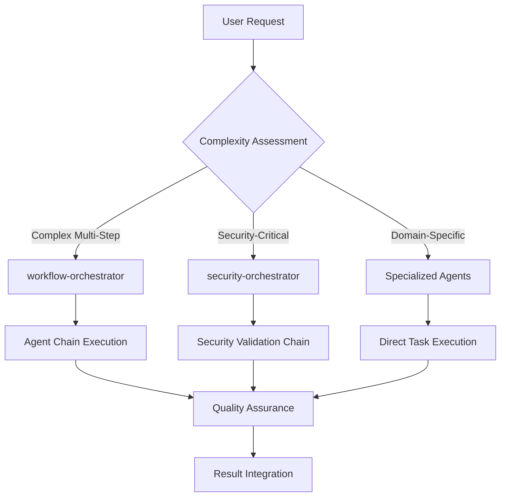

# Agent System Reference

## Table of Contents

- [System Overview](#system-overview)
- [Agent Hierarchy](#agent-hierarchy)
- [Orchestration Patterns](#orchestration-patterns)
- [Tool Permissions](#tool-permissions)
- [Model Allocation](#model-allocation)
- [Chain Configuration](#chain-configuration)
- [Compliance Validation](#compliance-validation)

## System Overview

The CC-Boilerplate implements a **Hierarchical Multi-Agent Architecture** (ADR-007) with autonomous orchestration, security-first tool allocation, and cognitive load-based model assignment.

### Core Principles

```
🏗️ **HIERARCHICAL STRUCTURE** - Orchestrators coordinate specialists
🔐 **SECURITY BOUNDARIES** - Role-based tool restrictions enforced
🧠 **COGNITIVE OPTIMIZATION** - Model allocation matches task complexity
🔗 **MANDATORY CHAINS** - Security validation enforced automatically
🎯 **AUTONOMOUS SELECTION** - Agents selected by task description matching
```

### Architecture Components



## Agent Hierarchy

### Primary Orchestrators (Opus Model)

#### workflow-orchestrator
- **Purpose**: Complex multi-step coordination and feature implementation
- **Use When**: Tasks requiring 3+ agents, cross-domain coordination
- **Tools**: Task, TodoWrite, Read
- **Model**: opus (high cognitive load for strategic planning)

#### security-orchestrator
- **Purpose**: Security validation chain coordination
- **Use When**: ANY security-critical code modifications
- **Tools**: Task, Read
- **Model**: haiku (simple chain triggering)

### Specialized Agents (Sonnet Model)

#### Code Quality Domain
- **code-reviewer**: Analysis-only code quality and security review
- **security-scanner**: OWASP vulnerability detection and analysis
- **test-automator**: Test creation and validation with execution
- **debugger**: Root cause analysis and fix implementation

#### Research Domain
- **technical-researcher**: External research and framework evaluation
- **ai-engineering-researcher**: AI/ML developments and research
- **context-engineer**: Context optimization and prompt improvement

#### Documentation Domain
- **smart-doc-generator**: README, API docs, comprehensive documentation
- **adr-creator**: Architectural Decision Record creation
- **pr-optimizer**: GitHub PR creation and optimization

#### GitHub Integration
- **github-checker**: Repository maintenance and status checks
- **dependency-manager**: Package updates and security alerts

### Analysis Agents (Sonnet/Haiku Models)

#### Read-Only Analyzers
- **test-coverage-analyzer**: Coverage analysis and gap identification
- **work-completion-summary**: Brief summaries and TTS integration

#### Meta Agents
- **meta-agent**: Agent creation and configuration generation

## Orchestration Patterns

### Pattern 1: Feature Development Chain

```yaml
Trigger: Complex feature request
Sequence:
  1. workflow-orchestrator (coordination planning)
  2. technical-researcher (external research)
  3. adr-creator (if architectural decisions needed)
  4. debugger or specialized implementation agent
  5. security-orchestrator (mandatory security validation)
     ├── code-reviewer (security analysis)
     └── security-scanner (vulnerability detection)
  6. test-automator (test creation)
  7. smart-doc-generator (documentation updates)
```

### Pattern 2: Security Validation Chain (Mandatory)

```yaml
Trigger: ANY code modification
Mandatory Sequence:
  1. code-reviewer (read-only security analysis)
  2. security-orchestrator (chain coordination)
  3. security-scanner (vulnerability detection)

Result: BLOCK if security issues found, PROCEED if validated
```

### Pattern 3: Bug Investigation and Resolution

```yaml
Trigger: Error detection or bug report
Sequence:
  1. debugger (root cause analysis)
  2. technical-researcher (if external knowledge needed)
  3. Implementation (debugger or domain specialist)
  4. security-orchestrator (mandatory security check)
  5. test-automator (regression testing)
  6. smart-doc-generator (documentation updates)
```

## Tool Permissions

Tool allocation follows the **principle of least privilege** with role-based access control.

### Security Levels

#### read_only (Analysis Agents)
```yaml
Tools Allowed:
  - Read, Grep, Glob
  - Bash(git:*) # Only git commands
  - WebSearch, WebFetch
  - Task

Tools Forbidden:
  - Write, Edit, MultiEdit
  - Bash(*) # Except git commands

Risk Level: Low
Confirmation Required: No
```

#### write_limited (Content Creation Agents)
```yaml
Tools Allowed:
  - Read, Write, Edit, MultiEdit
  - Grep, Glob, Task

Tools Forbidden:
  - Bash(*) # No command execution
  - NotebookEdit

Risk Level: Medium
Confirmation Required: Yes
```

#### execution_restricted (GitHub/System Agents)
```yaml
Tools Allowed:
  - Read, Task
  - Bash(git:*, test:*, npm:*, gh:*, security:*)

Tools Forbidden:
  - Write, Edit
  - Bash(rm:*, sudo:*)

Risk Level: Medium
Confirmation Required: Yes
```

#### full_access (Orchestrators and Meta Agents)
```yaml
Tools Allowed: ["*"]
Tools Forbidden: []
Risk Level: High
Confirmation Required: Yes
```

### Agent-Specific Permissions

| Agent | Security Level | Key Tools | Rationale |
|-------|---------------|-----------|-----------|
| code-reviewer | read_only | Read, Grep, Bash(git diff) | Analysis only, no modification |
| security-scanner | read_only | Read, WebSearch, Bash(security) | Security analysis, no changes |
| smart-doc-generator | write_limited | Read, Write, MultiEdit | Documentation creation |
| debugger | execution_restricted | Read, Write, Bash | Analysis + fixes + debugging |
| workflow-orchestrator | full_access | * | Strategic coordination |
| meta-agent | full_access | * | Agent creation requires full access |

## Model Allocation

Model assignment based on **cognitive load complexity** (ADR-008).

### Allocation Matrix

#### Opus (High Cognitive Load)
**Complex reasoning, synthesis, creation, judgment**

- **meta-agent**: Agent creation requires deep pattern understanding
- **workflow-orchestrator**: Strategic multi-step coordination
- **technical-researcher**: Complex source synthesis and evaluation
- **adr-creator**: Architectural decision analysis
- **debugger**: Complex logical reasoning chains
- **context-engineer**: Nuanced AI behavior understanding

#### Sonnet (Medium Cognitive Load)
**Analysis, pattern matching, structured execution**

- **code-reviewer**: Code pattern recognition and analysis
- **security-scanner**: Vulnerability pattern matching
- **test-automator**: Test pattern generation and coverage
- **smart-doc-generator**: Structured content creation
- **ai-engineering-researcher**: Research synthesis within domain

#### Haiku (Low Cognitive Load)
**Simple tasks, formatting, checks, template operations**

- **github-checker**: Simple status checks and API calls
- **dependency-manager**: Version comparisons and updates
- **work-completion-summary**: Brief summaries and TTS
- **security-orchestrator**: Simple chain triggering
- **pr-optimizer**: Template filling and formatting

### Dynamic Upgrading

```python
# Confidence-based model escalation
if agent_confidence < 80% and current_model != "opus":
    escalate_to_higher_model()

# Context pressure handling
if context_compression > 70%:
    prefer_higher_capability_model()

# Error recovery
if task_failed and retries_remaining > 0:
    retry_with_next_tier_model()
```

## Chain Configuration

### Agent Orchestration Configuration

```yaml
# .claude/agents/config/agent-orchestration.yaml

chains:
  security_validation:
    description: "Mandatory security chain for code modifications"
    trigger: "code_change"
    mandatory: true
    sequence:
      - agent: "code-reviewer"
        tools: ["Read", "Grep", "Bash(git diff)"]
        timeout: 300
      - agent: "security-orchestrator"
        tools: ["Task", "Read"]
        timeout: 60
      - agent: "security-scanner"
        tools: ["Read", "WebSearch", "Bash(security)"]
        timeout: 600

  feature_development:
    description: "Complex feature implementation workflow"
    trigger: "feature_request"
    sequence:
      - agent: "workflow-orchestrator"
        parallel: false
      - agent: "technical-researcher"
        parallel: true
      - agent: "adr-creator"
        condition: "architectural_decision_needed"
      - chain: "security_validation"
        mandatory: true

  bug_resolution:
    description: "Bug investigation and fix workflow"
    trigger: "error_detected"
    sequence:
      - agent: "debugger"
        tools: ["Read", "Write", "Bash"]
      - chain: "security_validation"
        mandatory: true
      - agent: "test-automator"
        parallel: true
```

### Chain Execution Engine

```python
# .claude/agents/config/chain-executor.py

class ChainExecutor:
    def execute_chain(self, chain_name: str, context: dict):
        """Execute agent chain with validation and error handling."""

        # 1. Load chain configuration
        chain_config = self.load_chain_config(chain_name)

        # 2. Validate tool permissions
        for step in chain_config.sequence:
            self.validate_agent_tools(step.agent, step.tools)

        # 3. Execute sequence with context accumulation
        results = []
        for step in chain_config.sequence:
            if step.get('parallel'):
                result = self.execute_parallel(step, context)
            else:
                result = self.execute_sequential(step, context)

            context.update(result)
            results.append(result)

            # Check for blocking conditions
            if result.get('blocked'):
                return self.handle_chain_block(result, chain_name)

        return self.aggregate_results(results)
```

## Compliance Validation

### Validation Script Usage

```bash
# Quick compliance check
./.claude/hooks/check-agents.sh

# Detailed analysis with suggestions
./.claude/hooks/check-agents.sh --verbose

# What gets validated:
# ✓ Hierarchical placement (orchestrators/, specialists/, analyzers/)
# ✓ Tool allocation boundaries (3-7 tools per agent)
# ✓ Model allocation rules (cognitive load matching)
# ✓ Description format (ALWAYS/NEVER/RUNS AFTER/HANDS OFF TO)
# ✓ Security chain integration
# ✓ Agent chain configuration integrity
```

### Validation Categories

#### Architecture Compliance
- **Agent placement**: Correct subdirectory based on role
- **Naming conventions**: kebab-case filenames matching agent names
- **Hierarchy adherence**: Proper orchestrator → specialist → analyzer structure

#### Tool Security
- **Permission boundaries**: Agents only have necessary tools
- **Security isolation**: Read-only agents cannot modify files
- **Tool count limits**: 3-7 tools per agent for cognitive load optimization

#### Model Allocation
- **Complexity matching**: Model matches cognitive load requirements
- **Cost optimization**: No over-allocation of expensive models
- **Consistency**: Similar agents use similar models

#### Chain Integration
- **Security chains**: Mandatory security validation configured
- **Handoff patterns**: Proper agent-to-agent coordination
- **Error handling**: Fallback mechanisms defined

### Common Compliance Issues

```bash
❌ ISSUE: Agent has 12 tools (exceeds cognitive load limit of 7)
✅ FIX: Reduce to core tools or split into multiple specialized agents

❌ ISSUE: Read-only agent has Write tool access
✅ FIX: Remove Write tools, change to write_limited security level

❌ ISSUE: Simple task agent using opus model
✅ FIX: Change to sonnet or haiku based on cognitive complexity

❌ ISSUE: Missing security chain integration
✅ FIX: Add mandatory security validation handoff
```

## Best Practices

### Agent Selection Guidelines

1. **Complex multi-step tasks** → Use workflow-orchestrator
2. **Security-critical code** → Mandatory security chain (non-negotiable)
3. **Domain-specific work** → Use appropriate specialist
4. **Analysis-only tasks** → Use read-only analyzers
5. **Simple formatting** → Use haiku-model agents

### Orchestration Guidelines

1. **Plan workflows** with TodoWrite before agent delegation
2. **Respect tool boundaries** - never override security restrictions
3. **Chain mandatory validations** for security-critical operations
4. **Optimize model allocation** based on actual cognitive complexity
5. **Document decisions** in agent coordination workflows

### Error Handling

1. **Agent failures** → Retry with alternative agent or escalate model
2. **Security violations** → Immediately involve security-orchestrator
3. **Tool permission errors** → Check .claude/agents/config/tool-permissions.yaml
4. **Chain interruptions** → Resume from last successful checkpoint

This reference provides complete documentation for understanding, using, and extending the hierarchical multi-agent system in CC-Boilerplate.