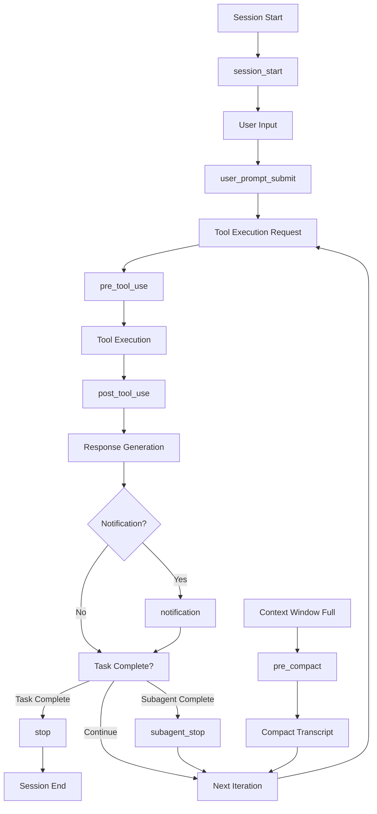

# Hooks API Reference

## Table of Contents

- [System Architecture](#system-architecture)
- [Hook Execution Lifecycle](#hook-execution-lifecycle)
- [Hook Specifications](#hook-specifications)
- [Input/Output Formats](#inputoutput-formats)
- [Exit Codes and Error Handling](#exit-codes-and-error-handling)
- [Configuration Options](#configuration-options)
- [Integration Examples](#integration-examples)
- [Security Considerations](#security-considerations)
- [Troubleshooting Guide](#troubleshooting-guide)

## System Architecture

The CC-Boilerplate hook system provides extensible event-driven automation for Claude Code interactions. The system consists of 8 hooks that execute at specific points in the Claude Code lifecycle.

### Hook Directory Structure

```
.claude/hooks/
├── pre_compact.py           # Backup transcripts before compaction
├── pre_tool_use.py         # Security validation before tool execution
├── post_tool_use.py        # Logging and post-processing after tools
├── session_start.py        # Development context loading
├── user_prompt_submit.py   # User input preprocessing
├── notification.py         # Custom notifications with TTS
├── stop.py                 # Task completion handling
├── subagent_stop.py        # Subagent completion announcements
└── utils/
    ├── llm/                # LLM provider utilities
    │   ├── ollama.py       # Local Ollama integration
    │   ├── oai.py          # OpenAI API integration
    │   └── anth.py         # Anthropic API integration
    └── tts/                # Text-to-speech utilities
        ├── pyttsx3_tts.py  # Local TTS (offline)
        ├── openai_tts.py   # OpenAI TTS API
        └── elevenlabs_tts.py # ElevenLabs TTS API
```

### Execution Environment

All hooks are executed as standalone Python scripts using UV's script runner:

- **Runtime**: Python 3.11+ with UV script dependencies
- **Input**: JSON data via stdin
- **Output**: stdout (normal), stderr (errors), JSON (structured data)
- **Exit Codes**: 0 (success), 1 (warning), 2 (block/error)

## Hook Execution Lifecycle

### Execution Order



### Lifecycle Events

| Event | Hook | Trigger | Purpose |
|-------|------|---------|---------|
| **Session Initialize** | `session_start` | New session begins | Load development context, announce start |
| **User Input** | `user_prompt_submit` | User submits prompt | Validate input, log interaction |
| **Pre-Tool** | `pre_tool_use` | Before tool execution | Security checks, dangerous command blocking |
| **Post-Tool** | `post_tool_use` | After tool execution | Log results, post-process output |
| **Notification** | `notification` | Claude requests input | TTS announcements, user alerts |
| **Task Complete** | `stop` | Task completion | Completion announcements, transcript export |
| **Subagent Complete** | `subagent_stop` | Subagent finishes | Subagent-specific completion handling |
| **Context Full** | `pre_compact` | Before compaction | Backup transcript, prepare for compaction |

## Hook Specifications

### 1. session_start.py

**Purpose**: Initialize session with development context and announcements.

**Execution**: When a new Claude Code session begins.

**Input Format**:

```json
{
  "session_id": "string",
  "source": "startup|resume|clear"
}
```

**Command Line Options**:

- `--load-context`: Load development context (git status, TODO files, issues)
- `--announce`: TTS announcement of session start

**Output**: JSON with optional additional context

**Exit Codes**:

- `0`: Success
- `1`: Warning (continues execution)
- `2`: Error (continues execution)

**Key Features**:

- Git status detection (branch, uncommitted changes)
- GitHub issue loading via `gh` CLI
- Development context files loading (.claude/CONTEXT.md, TODO.md)
- TTS session start announcements

### 2. user_prompt_submit.py

**Purpose**: Pre-process and validate user prompts before processing.

**Input Format**:

```json
{
  "session_id": "string",
  "prompt": "string"
}
```

**Command Line Options**:

- `--validate`: Enable prompt validation (blocks dangerous prompts)
- `--log-only`: Logging only, no validation
- `--store-last-prompt`: Store prompt for status display
- `--name-agent`: Generate agent name for session

**Exit Codes**:

- `0`: Success, continue processing
- `1`: Warning (continues)
- `2`: Block prompt with error message

**Key Features**:

- Prompt validation against blocked patterns
- Session data management (JSON structure)
- Agent name generation via LLM providers
- Comprehensive logging

### 3. pre_tool_use.py

**Purpose**: Security validation and logging before tool execution.

**Input Format**:

```json
{
  "tool_name": "string",
  "tool_input": {
    "command": "string",
    "file_path": "string"
  }
}
```

**Exit Codes**:

- `0`: Allow tool execution
- `2`: Block tool execution with error message

**Security Features**: For comprehensive security validation details including dangerous command patterns, environment file protection, and validation logic, see [Security Guide](../guides/security.md).

### 4. post_tool_use.py

**Purpose**: Log and post-process tool execution results.

**Input Format**:

```json
{
  "tool_name": "string",
  "tool_input": {},
  "tool_output": "string",
  "success": true,
  "execution_time": 1.23
}
```

**Features**:

- Comprehensive execution logging
- Performance metrics collection
- Error tracking and analysis
- Output post-processing

### 5. notification.py

**Purpose**: Handle user notifications with intelligent TTS announcements.

**Input Format**:

```json
{
  "message": "string",
  "type": "info|warning|error",
  "timestamp": "ISO8601"
}
```

**Command Line Options**:

- `--notify`: Enable TTS notifications

**TTS Provider Selection**:

1. **ElevenLabs** (if `ELEVENLABS_API_KEY` available)
2. **OpenAI TTS** (if `OPENAI_API_KEY` available)
3. **pyttsx3** (local fallback, always available)

**Features**:

- Intelligent TTS provider fallback
- Engineer name personalization (30% probability)
- Message filtering (skips generic "waiting for input")
- Error handling with silent failures

### 6. stop.py

**Purpose**: Handle task completion with announcements and transcript export.

**Input Format**:

```json
{
  "session_id": "string",
  "stop_hook_active": true,
  "transcript_path": "string"
}
```

**Command Line Options**:

- `--chat`: Export transcript to `logs/chat.json`
- `--notify`: TTS completion announcement

**Features**:

- LLM-generated completion messages (OpenAI → Anthropic → Ollama → fallback)
- Transcript export from JSONL to JSON
- Multi-provider TTS announcements
- Engineer name personalization

### 7. subagent_stop.py

**Purpose**: Handle subagent completion with specialized announcements.

**Input Format**: Same as `stop.py`

**Command Line Options**: Same as `stop.py`

**Features**:

- Fixed "Subagent Complete" message
- Same transcript export capability as main stop hook
- TTS announcement support

### 8. pre_compact.py

**Purpose**: Backup transcripts before context window compaction.

**Input Format**:

```json
{
  "session_id": "string",
  "transcript_path": "string",
  "trigger": "manual|auto",
  "custom_instructions": "string"
}
```

**Command Line Options**:

- `--backup`: Create backup of transcript before compaction
- `--verbose`: Print detailed compaction information

**Features**:

- Automatic transcript backup with timestamps
- Manual vs auto-compaction detection
- Custom instruction logging
- Backup organized in `logs/transcript_backups/`

## Input/Output Formats

### Standard Input Format

All hooks receive JSON data via stdin:

```json
{
  "session_id": "550e8400-e29b-41d4-a716-446655440000",
  "timestamp": "2025-01-09T10:30:00Z",
  "hook_specific_field": "value"
}
```

### Standard Output Formats

#### Success (Exit Code 0)

```json
{
  "hookSpecificOutput": {
    "hookEventName": "HookName",
    "additionalContext": "string",
    "metadata": {}
  }
}
```

#### Error/Block (Exit Code 2)

```bash
# stderr output
BLOCKED: Dangerous rm command detected and prevented
```

### Logging Output

All hooks log to `logs/{hook_name}.json`:

```json
[
  {
    "session_id": "string",
    "timestamp": "ISO8601",
    "input_data": {},
    "execution_result": "success|warning|error"
  }
]
```

## Exit Codes and Error Handling

### Exit Code Meanings

| Code | Meaning | Behavior |
|------|---------|----------|
| **0** | Success | Continue normal execution |
| **1** | Warning | Log warning, continue execution |
| **2** | Block/Error | Block operation, show error to user |

### Error Handling Strategy

All hooks implement graceful error handling:

```python
try:
    # Hook logic here
    sys.exit(0)
except json.JSONDecodeError:
    # Handle invalid JSON input
    sys.exit(0)  # Graceful degradation
except Exception:
    # Handle any other errors
    sys.exit(0)  # Don't break Claude Code
```

### Timeout Handling

Hooks have implicit timeouts:

- **Network operations**: 5-10 seconds
- **LLM calls**: 5-10 seconds
- **TTS generation**: 10 seconds
- **File operations**: No timeout (should be fast)

## Configuration Options

### Environment Variables

#### Global Hook Configuration

```bash
# Logging
HOOK_DEBUG=true                    # Enable debug output
HOOK_VERBOSE=true                  # Verbose logging
HOOK_LOG_LEVEL=info               # debug|info|warn|error

# TTS Configuration
TTS_PROVIDER=auto                 # auto|elevenlabs|openai|pyttsx3
TTS_FALLBACK_ENABLED=true         # Enable provider fallback
TTS_TIMEOUT=10                    # TTS generation timeout

# Engineer Personalization
ENGINEER_NAME="YourName"          # Used in TTS messages (30% chance)
```

#### Provider-Specific Configuration

**ElevenLabs**:

```bash
ELEVENLABS_API_KEY=your_key
ELEVENLABS_VOICE_NAME=Rachel
ELEVENLABS_MODEL_ID=eleven_multilingual_v2
ELEVENLABS_STABILITY=0.5
ELEVENLABS_SIMILARITY_BOOST=0.75
```

**OpenAI**:

```bash
OPENAI_API_KEY=your_key
OPENAI_TTS_VOICE=nova
OPENAI_TTS_MODEL=tts-1-hd
OPENAI_TTS_SPEED=1.0
```

**Ollama**:

```bash
OLLAMA_MODEL=gpt-oss:20b          # Default model
```

### Hook-Specific Configuration

**session_start.py**:

- Reads context files: `.claude/CONTEXT.md`, `TODO.md`, `.claude/TODO.md`
- Uses `gh` CLI for GitHub integration
- Loads development context automatically

**pre_tool_use.py**:

- Security patterns are hardcoded for safety
- Logs all tool attempts for audit
- Cannot be disabled (critical security feature)

## Integration Examples

### Basic Hook Testing

```bash
# Test session start hook
echo '{"session_id": "test-123", "source": "startup"}' | \
  uv run .claude/hooks/session_start.py --load-context --announce

# Test security hook
echo '{"tool_name": "Bash", "tool_input": {"command": "rm -rf /"}}' | \
  uv run .claude/hooks/pre_tool_use.py

# Test completion hook
echo '{"session_id": "test-123", "stop_hook_active": true}' | \
  uv run .claude/hooks/stop.py --notify
```

### Custom Hook Development

```python
#!/usr/bin/env -S uv run --script
# /// script
# requires-python = ">=3.11"
# dependencies = ["python-dotenv"]
# ///

import json
import sys
from pathlib import Path

def main():
    try:
        # Read JSON input
        input_data = json.load(sys.stdin)

        # Hook logic here
        session_id = input_data.get('session_id', 'unknown')

        # Log the event
        log_dir = Path('logs')
        log_dir.mkdir(parents=True, exist_ok=True)

        # Always exit 0 for graceful handling
        sys.exit(0)

    except Exception:
        # Never break Claude Code
        sys.exit(0)

if __name__ == '__main__':
    main()
```

### Development Workflow Integration

```bash
# Development session with full context
.claude/hooks/session_start.py --load-context --announce << 'EOF'
{
  "session_id": "dev-session-001",
  "source": "startup"
}
EOF

# Monitoring hook execution
tail -f logs/*.json | jq '.'
```

## Security Considerations

### Built-in Security Features

#### Command Injection Prevention

- Comprehensive `rm -rf` detection with regex patterns
- Path traversal protection (`../`, root directory)
- Environment file protection (`.env` access blocking)
- Wildcard pattern protection in destructive contexts

#### API Key Protection

- Environment file access prevention
- API keys never logged in plaintext
- Secure credential handling in utility scripts

#### File System Protection

- Recursive deletion blocking
- System directory protection
- Backup creation before destructive operations

### Security Best Practices

#### Hook Development

- **Never trust user input**: Always validate and sanitize
- **Fail securely**: Exit with code 0 on errors to avoid breaking Claude
- **Log security events**: All blocked operations should be logged
- **Use allowlists**: Prefer allowlists over blocklists for security

#### Environment Security

- Store API keys in `.env` files (never commit)
- Use `.env.sample` for templates
- Restrict file permissions on sensitive files
- Regular security audits of hook patterns

### Audit and Monitoring

```bash
# Security event monitoring
grep "BLOCKED" logs/pre_tool_use.json
grep "dangerous\|security\|blocked" logs/*.json

# Hook execution analysis
jq '.[] | select(.tool_name == "Bash")' logs/pre_tool_use.json

# Failed authentication attempts
grep "authentication\|api.*error\|unauthorized" logs/*.json
```

## Troubleshooting Guide

### Common Issues

#### Issue 1: Hook Not Executing

**Symptoms**:

- Expected hook behavior not occurring
- No log files generated
- Silent failures

**Diagnosis**:

```bash
# Test hook directly
echo '{"test": true}' | uv run .claude/hooks/session_start.py --verbose

# Check hook permissions
ls -la .claude/hooks/*.py

# Verify UV installation
uv --version
```

**Solutions**:

- Ensure hooks are executable: `chmod +x .claude/hooks/*.py`
- Verify UV is installed and accessible
- Check Python dependencies in script headers

#### Issue 2: TTS Not Working

**Symptoms**:

- No audio output from notification/stop hooks
- Silent completion announcements

**Diagnosis**:

```bash
# Test TTS providers individually
uv run .claude/hooks/utils/tts/pyttsx3_tts.py "test"
uv run .claude/hooks/utils/tts/openai_tts.py "test" --debug
uv run .claude/hooks/utils/tts/elevenlabs_tts.py "test" --debug

# Check API keys
echo "OpenAI: ${OPENAI_API_KEY:0:10}..."
echo "ElevenLabs: ${ELEVENLABS_API_KEY:0:10}..."
```

**Solutions**:

- Install system TTS: `pyttsx3` should always work as fallback
- Configure at least one API key for premium TTS
- Check network connectivity for API-based TTS

#### Issue 3: Security Hook Blocking Valid Commands

**Symptoms**:

- Legitimate commands being blocked
- `pre_tool_use.py` returning exit code 2 incorrectly

**Diagnosis**:

```bash
# Test specific command patterns
echo '{"tool_name": "Bash", "tool_input": {"command": "your_command_here"}}' | \
  uv run .claude/hooks/pre_tool_use.py

# Check security patterns
grep -n "patterns\|blocked" .claude/hooks/pre_tool_use.py
```

**Solutions**:

- Review and adjust security patterns in `pre_tool_use.py`
- Add specific allowlists for legitimate use cases
- Test command variations to find safe alternatives

#### Issue 4: Session Context Not Loading

**Symptoms**:

- Missing development context at session start
- No git status or GitHub issues loaded

**Diagnosis**:

```bash
# Test context loading components
git rev-parse --abbrev-ref HEAD
git status --porcelain
gh issue list --limit 5 2>/dev/null || echo "gh not available"
ls -la .claude/CONTEXT.md TODO.md .claude/TODO.md
```

**Solutions**:

- Install `gh` CLI: `brew install gh` or equivalent
- Ensure git repository is properly initialized
- Create context files as needed

### Debug Mode

Enable comprehensive debugging:

```bash
# Enable debug environment
export HOOK_DEBUG=true
export HOOK_VERBOSE=true
export TTS_DEBUG=true

# Test with debug output
echo '{"session_id": "debug-test"}' | \
  uv run .claude/hooks/session_start.py --load-context 2>&1 | tee debug.log
```

### Log Analysis

```bash
# Hook execution timeline
ls -lat logs/*.json

# Error pattern analysis
grep -r "error\|Error\|ERROR" logs/ | head -20

# Performance analysis
jq '.[] | {timestamp, execution_time}' logs/post_tool_use.json | head -10

# Security event analysis
jq '.[] | select(.tool_name == "Bash") | .tool_input.command' logs/pre_tool_use.json
```

The CC-Boilerplate hook system provides a secure, extensible foundation for Claude Code automation while maintaining strict security controls and graceful error handling.
