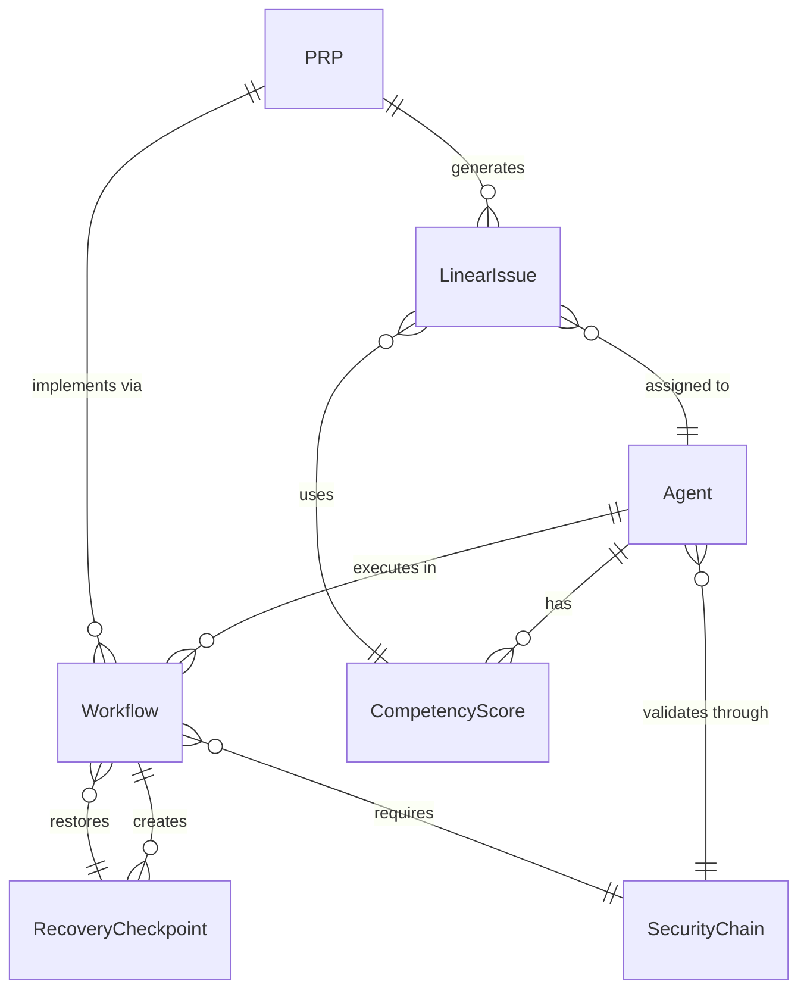

# Data Model: CC-Boilerplate Strategic Accelerator Framework

**Generated**: 2025-01-20
**Status**: Complete

## Overview

The CC-Boilerplate data model represents the core entities and relationships for the strategic accelerator framework. All entities are file-based for simplicity and git-trackability.

## Core Entities

### 1. Agent
**Description**: Specialized AI assistant with specific capabilities
**Storage**: `.claude/agents/{category}/{agent-name}.yaml`

```yaml
# Agent Entity Structure
agent:
  name: string                    # Unique identifier (e.g., "test-automator")
  description: string             # What the agent does
  category: enum                  # orchestrator | specialist | analyzer | utility
  model: enum                     # haiku | sonnet | opus
  tools:                          # Permitted tools
    - tool_name: string
      permissions: array          # read | write | execute
  capabilities:                   # For discovery
    - domain: string              # testing | security | documentation
    - tags: array                 # Keywords for matching
  dependencies:                   # Other agents required
    - agent_name: string
  validation:
    mandatory_chain: string       # e.g., "security-orchestrator"
    hands_off_to: array          # Next agents in workflow
```

**Validation Rules**:
- Name must be unique across all agents
- Category determines available tool permissions
- Model assignment must align with cognitive load (ADR-008)
- Tools must respect least-privilege principle

### 2. PRP (Product Requirements Process)
**Description**: Comprehensive requirements document
**Storage**: `PRPs/{prp-name}.md`

```yaml
# PRP Entity Structure
prp:
  name: string                    # Unique identifier
  type: enum                      # product | feature | technical | migration
  version: string                 # Semantic versioning
  status: enum                    # proposed | approved | implemented | deprecated
  created: date
  description: text               # Executive summary
  business_value: string          # Clear value proposition
  target_users: array             # Persona identifiers
  success_metrics: array          # Measurable outcomes
  requirements:                   # Core requirements
    functional: array
      - id: string                # FR-001 format
      - description: text
      - priority: enum            # must | should | could
    non_functional: array
      - category: string          # performance | security | usability
      - requirement: text
  dependencies:                   # External dependencies
    - type: string                # service | library | system
      - name: string
```

**Validation Rules**:
- Version must follow semantic versioning
- All functional requirements must be testable
- Success metrics must be measurable
- Status transitions must be audited

### 3. Workflow
**Description**: Coordinated sequence of agent actions
**Storage**: `.claude/workflows/{workflow-name}.yaml`

```yaml
# Workflow Entity Structure
workflow:
  name: string                    # Unique identifier
  trigger: enum                   # manual | command | event | schedule
  stages:                         # Sequential execution
    - stage_name: string
      agent: string               # Agent to execute
      input: object               # Stage input data
      validation:                 # Success criteria
        - condition: string
      on_success: string          # Next stage
      on_failure: string          # Error handling
  security:
    requires_chain: boolean       # Mandatory security validation
    audit_level: enum             # none | basic | comprehensive
  timeout: integer                # Max execution time (seconds)
```

**Validation Rules**:
- All referenced agents must exist
- Security chain required for code modifications
- Circular dependencies prohibited
- Timeout must be reasonable (<3600s)

### 4. CompetencyScore
**Description**: AI capability assessment for tasks
**Storage**: `.claude/competency/{agent-name}-scores.json`

```json
{
  "agent": "string",
  "scores": {
    "task_type": {
      "score": 0.0-1.0,
      "confidence": 0.0-1.0,
      "samples": 0,
      "last_updated": "timestamp",
      "history": [
        {
          "timestamp": "ISO8601",
          "score": 0.0-1.0,
          "task_id": "string",
          "outcome": "success|failure"
        }
      ]
    }
  },
  "thresholds": {
    "auto_assign": 0.8,
    "suggest": 0.6,
    "manual": 0.0
  }
}
```

**Validation Rules**:
- Scores must be between 0.0 and 1.0
- Minimum 3 samples before auto-assignment
- Score decay if not updated in 30 days
- Human override always permitted

### 5. SecurityChain
**Description**: Mandatory validation sequence
**Storage**: `.claude/security/chains.yaml`

```yaml
# SecurityChain Entity Structure
chain:
  name: string                    # Chain identifier
  triggers:                       # When to activate
    - pattern: regex              # Command patterns
    - file_types: array           # File extensions
    - operations: array           # create | modify | delete
  validators:                     # Sequential validators
    - agent: string               # Validator agent
      level: enum                 # info | warning | error | block
      timeout: integer            # Max validation time
  bypass:
    requires_confirmation: boolean
    audit_required: boolean
    temporary_duration: integer   # Seconds
```

**Validation Rules**:
- At least one validator required
- Block level stops execution
- Bypass creates audit entry
- Patterns must be tested for false positives

### 6. LinearIssue
**Description**: Task synchronized with Linear
**Storage**: `.claude/linear/issues/{issue-id}.json`

```json
{
  "id": "string",
  "linear_id": "string",
  "title": "string",
  "description": "text",
  "state": "backlog|todo|in_progress|done|cancelled",
  "assignee": {
    "type": "human|ai",
    "id": "string",
    "agent": "string"
  },
  "competency": {
    "score": 0.0-1.0,
    "confidence": 0.0-1.0,
    "recommended_agent": "string"
  },
  "sync": {
    "last_synced": "timestamp",
    "version": 0,
    "conflicts": []
  }
}
```

**Validation Rules**:
- Linear ID must be valid
- State transitions must be valid
- Competency score required for AI assignment
- Conflict resolution preserves latest changes

### 7. RecoveryCheckpoint
**Description**: System state for recovery
**Storage**: `.claude/recovery/checkpoints/{timestamp}.yaml`

```yaml
# RecoveryCheckpoint Entity Structure
checkpoint:
  id: string                      # UUID
  timestamp: datetime
  type: enum                      # manual | auto | pre_operation
  state:
    git:
      branch: string
      commit: string
      uncommitted: array          # File paths
    workflows:
      active: array               # Running workflows
      queued: array               # Pending workflows
    agents:
      active: array               # Active agents
  metadata:
    reason: string                # Why checkpoint created
    user: string
    expires: datetime             # Auto-cleanup time
```

**Validation Rules**:
- Checkpoints expire after 7 days
- Maximum 10 checkpoints retained
- Git state must be complete
- Restore must validate consistency

## Entity Relationships



## State Transitions

### Agent Lifecycle
```
inactive -> available -> executing -> completed -> inactive
                |            |
                v            v
            suspended     failed -> recovery -> available
```

### PRP Status Flow
```
proposed -> approved -> implemented -> deprecated
    |          |            |
    v          v            v
rejected   revised     validated
```

### LinearIssue States
```
backlog -> todo -> in_progress -> done
            |          |            |
            v          v            v
        cancelled   blocked     reviewed
```

## Data Integrity

### Consistency Rules
1. **Referential Integrity**: All foreign keys must reference existing entities
2. **State Consistency**: Invalid state transitions are blocked
3. **Audit Trail**: All modifications logged with timestamp and actor
4. **Version Control**: Git provides natural versioning for all entities

### Backup Strategy
1. **Git-based**: All data in git repository
2. **Checkpoints**: Automatic before risky operations
3. **Recovery**: Atomic rollback to any checkpoint
4. **Archive**: Old data moved to `.claude/archive/`

## Performance Considerations

### Indexing
- Agent capability matrix cached in memory
- Competency scores indexed by task type
- Workflow templates pre-loaded at startup

### Optimization
- Lazy loading for large entities
- Incremental sync for Linear issues
- Background cleanup of expired data
- Parallel execution where possible

## Security Model

### Access Control
- **Read-Only**: Analyzers can only read data
- **Domain-Restricted**: Specialists limited to their domain
- **Full Access**: Orchestrators can coordinate everything
- **Audit Required**: All security-sensitive operations logged

### Data Protection
- No credentials stored in entities
- Sensitive data in environment variables
- Encryption for external API tokens
- Regular security audit of access patterns

---
*Data model designed for simplicity, git-trackability, and constitutional compliance*